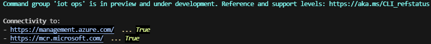
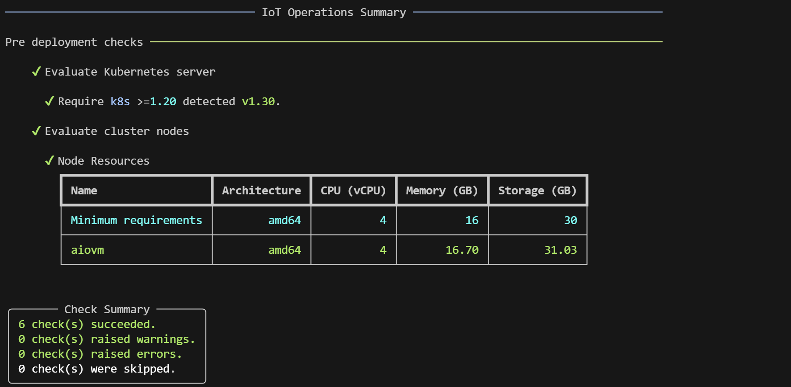

### Part 1 - Provision resources (Edge and Cloud)

#### Prepare and provision Cloud platform
   - Open a browser and navigate to the [Azure Portal](https://portal.azure.com/)
   - Use the [Azure Cloud Shell (**Bash**)](https://learn.microsoft.com/en-us/azure/cloud-shell/get-started/ephemeral?tabs=azurecli#start-cloud-shell)
   - Set Environment Variables for services to create in Azure:
     ```bash
     export SUBSCRIPTION_ID="<YOUR_SUBSCRIPTION_ID>"
     export LOCATION="<YOUR_REGION>"
     export RESOURCE_GROUP="<YOUR_RESOURCE_GROUP>"
     export STORAGE_ACCOUNT_NAME="<YOUR_STORAGE_ACCOUNT_NAME>"
     export SCHEMA_REGISTRY_NAME="<YOUR_SCHEMA_REGISTRY_NAME>"
     export SCHEMA_REGISTRY_NAMESPACE="<YOUR_SCHEMA_REGISTRY_NAMESPACE>"
     export EVENTHUB_NAMESPACE="<YOUR_EVENTHUB_NAMESPACE>"
     export EVENTHUB_NAME="<YOUR_EVENTHUB_NAME>"
     export AZURE_OPENAI_NAME="<YOUR_AZURE_OPENAI_NAME>"
     ```
     > **NOTE(1)**: keep a note of the environment variables for future use.
   - Set Azure Subscription context:
     ```bash
     az account set --subscription $SUBSCRIPTION_ID
     ```
   - Create a service principal (service account) to manage Azure:
     ```bash
     SPN=$(az ad sp create-for-rbac --name AIO_SP_Contrib --role Contributor --scopes /subscriptions/$SUBSCRIPTION_ID)
     ```
      > **NOTE(2)**: create 3 variables with: `appId`, `password` and `tenant`, from the output of the command, and **keep a note of them for future use**.
     ```bash
     export APP_ID=$(echo $SPN | jq -r .appId)
     export APP_SECRET=$(echo $SPN | jq -r .password)
     export TENANT=$(echo $SPN | jq -r .tenant)
     ```
   - Create a service principal (service account) for the Factory Assistant:
     ```bash
     SPN2=$(az ad sp create-for-rbac --name GenAI_Factory_Assistant)
     ```
      > **NOTE(2)**: create 2 variables with: `appId` and `password`, from the output of the command, and **keep a note of them for future use**.
     ```bash
     export ASSISTANT_APP_ID=$(echo $SPN2 | jq -r .appId)
     export ASSISTANT_APP_SECRET=$(echo $SPN2 | jq -r .password)
     ```
   - Get `objectId` of `Microsoft Entra ID` application and create 1 variable:
     ```bash
     export OBJECT_ID=$(az ad sp show --id bc313c14-388c-4e7d-a58e-70017303ee3b --query id --output tsv)
     ```
   - Register required Resource Providers (execute this step only once per subscription):
     ```bash
      az provider register -n "Microsoft.ExtendedLocation"
      az provider register -n "Microsoft.Kubernetes"
      az provider register -n "Microsoft.KubernetesConfiguration"
      az provider register -n "Microsoft.IoTOperations"
      az provider register -n "Microsoft.DeviceRegistry"
      az provider register -n "Microsoft.SecretSyncController"
     ```
   - Create a Resource Group:
     ```bash
     az group create --location $LOCATION --resource-group $RESOURCE_GROUP --subscription $SUBSCRIPTION_ID
     ```
   - Assign role to the service principal `SPN`
      ```bash
      az role assignment create --assignee $APP_ID --role "Role Based Access Control Administrator" --scope subscriptions/$SUBSCRIPTION_ID/resourceGroups/$RESOURCE_GROUP
      ```
   - Create a storage account with `hierarchical namespace enabled`:
     ```bash
     az storage account create --name $STORAGE_ACCOUNT_NAME --resource-group $RESOURCE_GROUP --enable-hierarchical-namespace
     ```
   - Install `Azure IoT Operations extension`:
      ```bash
      az extension add --name azure-iot-ops --version 1.0.0
      ```
   - Create a schema registry that connects to your storage account:
     ```bash
     az iot ops schema registry create --name $SCHEMA_REGISTRY_NAME --resource-group $RESOURCE_GROUP --registry-namespace $SCHEMA_REGISTRY_NAMESPACE --sa-resource-id $(az storage account show --name $STORAGE_ACCOUNT_NAME --resource-group $RESOURCE_GROUP -o tsv --query id)
     ```
   - Create an Event Hub name space:
     ```bash
     az eventhubs namespace create --name $EVENTHUB_NAMESPACE --resource-group $RESOURCE_GROUP --location $LOCATION
     ```
   - Create an Event Hub:
     ```bash
     az eventhubs eventhub create --name $EVENTHUB_NAME --resource-group $RESOURCE_GROUP --namespace-name $EVENTHUB_NAMESPACE
     ```
   - Retrieve the Event Hub Connection String and create 2 variables:
     ```bash
     EVENTHUB_KEY_CREATE=$(az eventhubs namespace authorization-rule create --resource-group $RESOURCE_GROUP --namespace-name $EVENTHUB_NAMESPACE --name Listen --rights Listen)
     EVENTHUB_KEY_INFO=$(az eventhubs namespace authorization-rule keys list --resource-group $RESOURCE_GROUP --namespace-name $EVENTHUB_NAMESPACE --name Listen)
     export EVENTHUB_KEYNAME=$(echo $EVENTHUB_KEY_INFO | jq -r .keyName)
     export EVENTHUB_KEY=$(echo $EVENTHUB_KEY_INFO | jq -r .primaryKey)
     ```
   - Create an Azure OpenAI resource:
     ```bash
     az cognitiveservices account create --name $AZURE_OPENAI_NAME --resource-group $RESOURCE_GROUP --location eastus --kind OpenAI --sku s0 --subscription $SUBSCRIPTION_ID
     ```
   - Retrieve the Azure OpenAI resource keys and create 1 variable:
     ```bash
     export AZURE_OPENAI_KEY=$(az cognitiveservices account keys list --name $AZURE_OPENAI_NAME --resource-group $RESOURCE_GROUP --query key1 --output tsv)
     ```
#### Prepare and provision Edge platform

- Hardware requirements
  - **Resources**: 
      - CPU: `4 vCPU`
      - Memory: `16GB`
      - Storage: `30GB`

  - **Operating System**: the solution requires a Linux-based system, specifically a VM or physical machine running `Linux Ubuntu 22.04` or `Linux Ubuntu 24.04`. This system will perform as an Edge server, handling queries directly from the production line and interfacing with other operational systems.

- Option A (Virtual Machine in Azure)
   - If you want to use a Virtual Machine in Azure, you can deploy it using the Deploy button below:  
      [](https://portal.azure.com/#create/Microsoft.Template/uri/https%3A%2F%2Fraw.githubusercontent.com%2Fchriscrcodes%2Fsmart-factory%2Frefs%2Fheads%2Fmain%2Fartifacts%2Ftemplates%2Fvm%2Fazuredeploy.json)
      - `Review + create` > `Create`

      > **Note**: `Standard_D4s_v3` is the recommended size for the Azure VM.

- Option B (your own Industrial PC or Virtual Machine)
  - Install `Linux Ubuntu 22.04`

- Prepare a K3s Kubernetes Cluster on Ubuntu (login and execute the following commands on your Ubuntu Machine)
   - Install `curl` and `nano`:
     ```bash
     sudo apt update
     sudo apt install curl nano jq -y
     ```
- Install K3s
   - Run the `K3s installation script`:
     ```bash
     curl -sfL https://get.k3s.io | sh -
     ```
   - Create a `K3s configuration` file in `.kube/config`:
     ```bash
     mkdir ~/.kube
     sudo KUBECONFIG=~/.kube/config:/etc/rancher/k3s/k3s.yaml kubectl config view --flatten > ~/.kube/merged
     mv ~/.kube/merged ~/.kube/config
     chmod  0600 ~/.kube/config
     export KUBECONFIG=~/.kube/config
     kubectl config use-context default
     ```
   - Increase user watch/instance limits:
     ```bash
     echo fs.inotify.max_user_instances=8192 | sudo tee -a /etc/sysctl.conf
     echo fs.inotify.max_user_watches=524288 | sudo tee -a /etc/sysctl.conf
     sudo sysctl -p
     ```
   - Increase file descriptor limit:
     ```bash
     echo fs.file-max = 100000 | sudo tee -a /etc/sysctl.conf
     sudo sysctl -p
     ```
- Check K3s installation
  ```bash
  kubectl get node
  ```
- Install k9s
    ```bash
    sudo snap install k9s
    alias k9s=/snap/k9s/current/bin/k9s
    echo "alias k9s=/snap/k9s/current/bin/k9s" >> ~/.bashrc
    ```
    > Note: you can browse pods using the following command: k9s -n azure-iot-operations
- Install Azure prerequisites
  - Install `Azure CLI`:
    ```bash
    curl -sL https://aka.ms/InstallAzureCLIDeb | sudo bash
    ```
  - Install `Azure arc extension`:
    ```bash
    az extension add --name connectedk8s --version 1.10.3
    ```
  - Install `Azure IoT Operations extension`:
    ```bash
    az extension add --name azure-iot-ops --version 1.0.0
    ```

- Prepare your Cluster for Azure IoT Operations
   - Check [Azure IoT Operations prerequisites](https://learn.microsoft.com/en-us/azure/iot-operations/deploy-iot-ops/howto-deploy-iot-operations?tabs=cli#prerequisites)

   - Validate Cluster readiness for Azure IoT Operations:
     ```bash
     az iot ops verify-host     
     ```

      

- Validate Azure IoT Operations pre-deployment checks  
    - Before the deployment, use `az iot ops check` to execute IoT Operations pre-deployment checks.  

    ```bash
    az iot ops check
    ```

    
      
- ✅ **You can now continue to** > [Part 2 - Connect your Edge platform to Cloud platform](./INSTALL-2.md)
