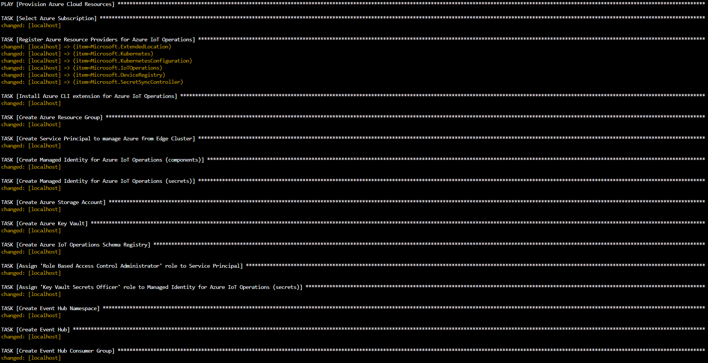
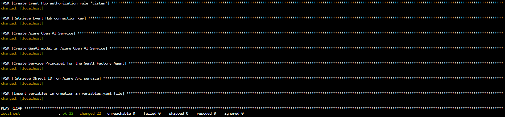
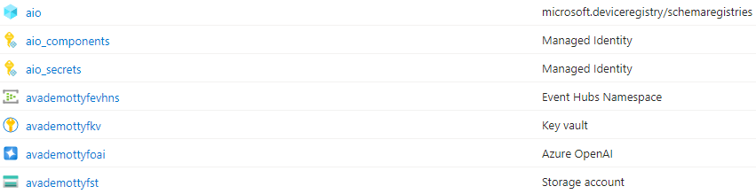
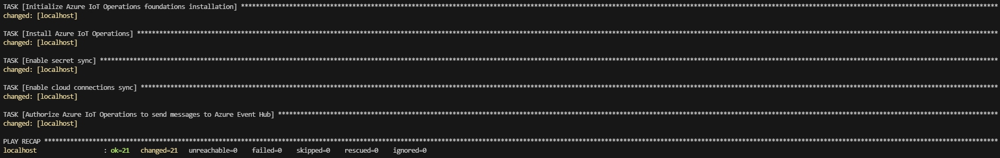
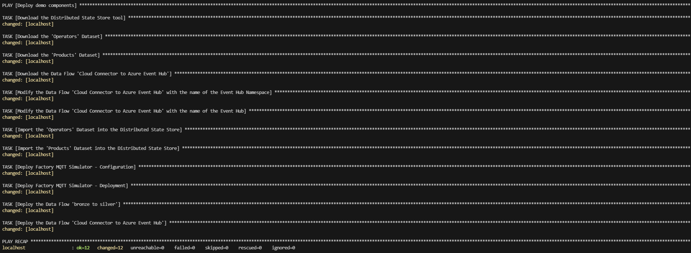
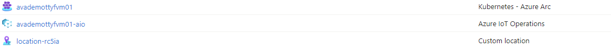
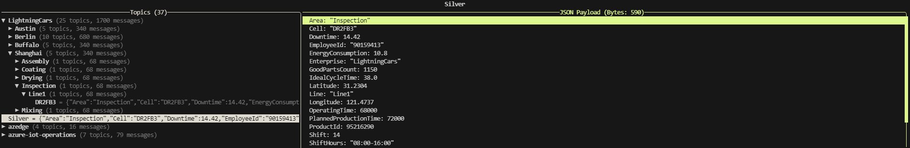

# Part 1 - Provision resources (Edge and Cloud)

## Prepare and provision Cloud platform
   - Download the file [`1_cloud-provision.yaml`](./artifacts/templates/deploy/1_cloud-provision.yaml)
   - Download the file [`variables_template.yaml`](./artifacts/templates/deploy/variables_template.yaml) and rename it to `variables.yaml`
   - Define variables in file `variables.yaml` to create Azure resources:
      ```bash
      SUBSCRIPTION_ID: ""                   # Id of your Azure subscription
      LOCATION: ""                          # Location (Azure region) where to create resources
      RESOURCE_GROUP: ""                    # Name of the Resource Group
      AIO_SERVICE_PRINCIPAL: ""             # Name of the Service Principal (service account) to manage Azure from the Edge Cluster, using Azure CLI (command-line interface)
      FACTORY_AGENT_SERVICE_PRINCIPAL: ""   # Name of the Service Principal (service account) for the Factory Agent
      AIO_MANAGED_IDENTITY_SECRETS: ""      # Name of the Managed Identity for Azure IoT Operations secrets
      AIO_MANAGED_IDENTITY_COMPONENTS: ""   # Name of the Managed Identity for Azure IoT Operations components
      KEYVAULT_NAME: ""                     # Name of the Key Vault
      STORAGEACCOUNT_NAME: ""               # Name of the Storage Account. Length: 3-24. Valid Characters: lowercase letters and numbers.
      EVENTHUB_NAMESPACE: ""                # Name of the Event Hub Namespace
      EVENTHUB_NAME: ""                     # Name of the Event Hub inside the Event Hub Namespace
      AIO_SCHEMA_REGISTRY_NAMESPACE: ""     # Name of the Schema Registry. Valid Characters: lowercase letters and numbers.
      AZURE_OPENAI_NAME: ""                 # Name of the Azure Open AI service
      AIO_CLUSTER_NAME: ""                  # Name of the Azure IoT Operations Cluster you want to deploy
      ```
   - Open a browser and navigate to the [Azure Portal](https://portal.azure.com/)
   - Use the [Azure Cloud Shell (**Bash**)](https://learn.microsoft.com/en-us/azure/cloud-shell/get-started/ephemeral?tabs=azurecli#start-cloud-shell)
   - Once the variables defined in file `variables.yaml`, upload the files `variables.yaml` and `1_cloud-provision.yaml` via `Manage files` > `Upload`. 
   - Execute the playbook in Azure Cloud Shell to provision Azure Cloud resources
     ```bash
     ansible-playbook 1_cloud-provision.yaml
     ```
   - You should see the following when the playbook has finished successfully:  
      
    
   - Now, open the `variables.yaml` file. It should contain new information (BEGIN/END ANSIBLE MANAGED BLOCK):
      ```bash
      # BEGIN ANSIBLE MANAGED BLOCK
      AIO_SP_APPID: "***"
      AIO_SP_SECRET: "***"
      AIO_SP_TENANT: "***"
      FACTORY_AGENT_SP_APPID: "***"
      FACTORY_AGENT_SP_SECRET: "***"
      ARC_OBJECT_ID: "***"
      SCHEMA_REGISTRY_ID: "***"
      KEYVAULT_ID: "***"
      AIO_MANAGED_IDENTITY_SECRETS_ID: "***"
      AIO_MANAGED_IDENTITY_COMPONENTS_ID: "***"
      EVENTHUB_ID: "***"
      # END ANSIBLE MANAGED BLOCK
      ```
   - Download the file `variables.yaml` via `Manage files` > `Download`.
   - Copy the file `variables.yaml` to your Edge Cluster.
   - You should now see the following resources in Azure (including hidden types):  
    
      
## Prepare and provision Edge Cluster

- Hardware requirements
  - **Resources**: 
      - CPU: `4 vCPU`
      - Memory: `16GB`
      - Storage: `30GB`

  - **Operating System**: the solution requires a Linux-based system, specifically a VM or physical machine running `Linux Ubuntu 22.04` or `Linux Ubuntu 24.04`. This system will perform as an Edge Cluster, handling queries directly from the production line and interfacing with other operational systems.

- Option A (Virtual Machine in Azure Cloud)
   - If you want to use a Virtual Machine in Azure, you can deploy it using the Deploy button below:  
      [](https://portal.azure.com/#create/Microsoft.Template/uri/https%3A%2F%2Fraw.githubusercontent.com%2Fchriscrcodes%2Fsmart-factory%2Frefs%2Fheads%2Fmain%2Fartifacts%2Ftemplates%2Fdeploy%2Fazure-vm.json)  
        
    - Fill the required information and click `Review + create` > `Create`
      > **Note**: `Standard_D4s_v3` is the recommended size for the Azure VM.

- Option B (your own Industrial PC or Virtual Machine)
  - Install `Linux Ubuntu 22.04` or `Linux Ubuntu 24.04`

- Copy the file `variables.yaml` to your Edge Cluster
- Login and execute the following commands on your Edge Cluster
    - Install `Ansible`:
      ```bash
      sudo apt update && sudo apt install ansible -y
      ```
    - Execute the playbook to prepare your Edge Cluster
      ```bash
      curl -O https://raw.githubusercontent.com/chriscrcodes/talk-to-your-factory/main/artifacts/templates/deploy/2_edge-prepare.yaml
      ansible-playbook 2_edge-prepare.yaml
      ```
      
    - Execute the playbook to install Azure IoT Operations to your Edge Cluster
      ```bash
      curl -O https://raw.githubusercontent.com/chriscrcodes/talk-to-your-factory/main/artifacts/templates/deploy/3_edge-install_aio.yaml
      ansible-playbook 3_edge-install_aio.yaml
      ```
      
    - Execute the playbook to configure Azure IoT Operations
      ```bash
      curl -O https://raw.githubusercontent.com/chriscrcodes/talk-to-your-factory/main/artifacts/templates/deploy/4_edge-configure_aio.yaml
      ansible-playbook 4_edge-configure_aio.yaml
      ```
      
    - You should now see the following additional resources in Azure (Azure Arc Cluster and Azure IoT Operations instance):  
    

## Confirm Factory Simulator is running on the Edge Cluster
  - Deploy MQTT Client
    ```bash
    kubectl apply -f https://raw.githubusercontent.com/chriscrcodes/talk-to-your-factory/main/artifacts/templates/k3s/pods/mqtt-client/pod.yaml
    ```

  - Connect to the container running the MQTT client
    ```bash
    kubectl exec --stdin --tty mqtt-client -n azure-iot-operations -- sh
    ```
  - From within the container, launch the MQTT client:
    ```bash
    mqttui --broker mqtt://aio-broker-insecure:1883 --insecure
    ```
  - Confirm if the 2 following topics are present:
    - `LightningCars` (data coming from the Factory Simulator)
    - `Silver` (data coming from Azure IoT Operations Data flows)  

    

## Confirm Data is flowing from Edge (Azure IoT Operations) to Cloud (Azure Event Hub)
  - Locate the Azure Event Hub Namespace you created in [Azure Portal](https://portal.azure.com/)
  - Data Explorer (preview) > select the event hub you created in [Step 1](#step-1---provision-azure-resources) (`EVENTHUB_NAME` variable)
  - Click on `View events` > and select an event on the right to confirm data flow is operational  
  

- ✅ **You can now continue to** > [Part 2 - Configure the solution in Microsoft Fabric](./INSTALL-2.md)