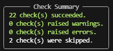
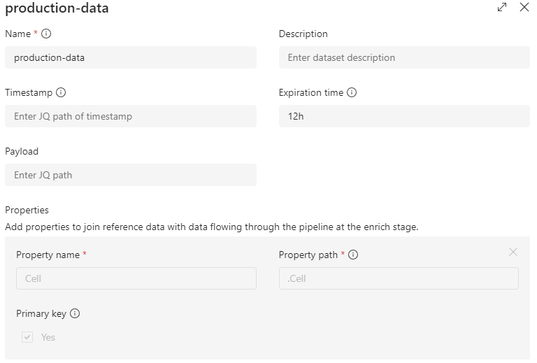
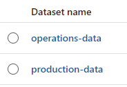
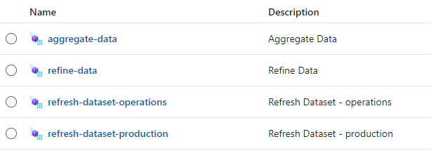
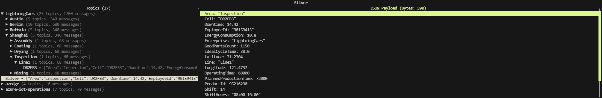
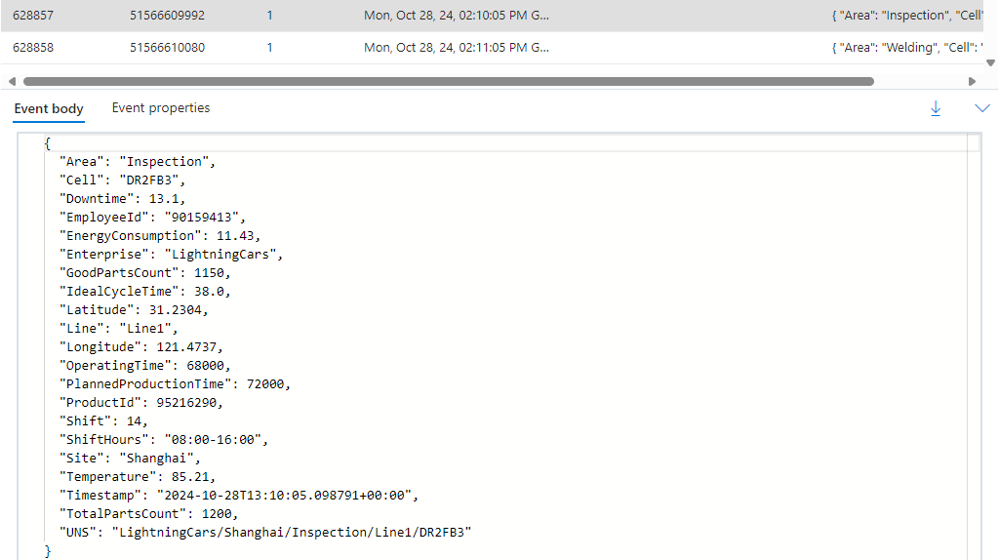

### Part 2 - Connect your Edge platform to Cloud platform
   - Login and execute the following commands on your Ubuntu Machine
   - Retrieve the environment variables you defined in [Part 1 - Provision resources (Edge and Cloud)](./INSTALL-1.md) ==> **Checkpoint (2)**:
     ```bash
     export APP_ID="<appId>"
     export APP_SECRET="<password>"
     export TENANT="<tenant>"
     export OBJECT_ID="<YOUR_AZURE_ARC_OBJECT_ID>"
     export SUBSCRIPTION_ID="<YOUR_SUBSCRIPTION_ID>"
     export LOCATION="<YOUR_REGION>"
     export RESOURCE_GROUP="<YOUR_RESOURCE_GROUP>"
     export KEYVAULT_NAME="<YOUR_KEYVAULT_NAME>"
     export EVENTHUB_NAMESPACE="<YOUR_EVENTHUB_NAMESPACE>"
     export EVENTHUB_NAME="<YOUR_EVENTHUB_NAME>"
     export AZURE_OPENAI_NAME="<YOUR_AZURE_OPENAI_NAME>"
     ```
   - Add an additional environment variable to define the name of the cluster to connect to Azure Arc:
     ```bash
     export CLUSTER_NAME="<YOUR_CLUSTER_NAME>"
     ```
   - Connect to Azure (using the service principal created in [Part 1 - Provision resources (Edge and Cloud)](./INSTALL-1.md))
     ```bash
     az login --service-principal -u $APP_ID -p $APP_SECRET --tenant $TENANT
     ```
   - Set Azure Subscription context:
     ```bash
     az account set -s $SUBSCRIPTION_ID
     ```
   - Connect Kubernetes Cluster to Azure:
     ```bash
     az connectedk8s connect -n $CLUSTER_NAME -l $LOCATION -g $RESOURCE_GROUP --subscription $SUBSCRIPTION_ID
     ```
   - Enable Custom Location support:
     ```bash
     az connectedk8s enable-features -n $CLUSTER_NAME -g $RESOURCE_GROUP --custom-locations-oid $OBJECT_ID --features cluster-connect custom-locations
     ```

#### Deploy and configure Azure IoT Operations (v0.5.1b1)

- Check [Azure IoT Operations prerequisites](https://learn.microsoft.com/en-us/azure/iot-operations/deploy-iot-ops/howto-deploy-iot-operations?tabs=cli#prerequisites)

- Prepare your Cluster for Azure IoT Operations
   - Validate Cluster readiness for Azure IoT Operations:
     ```bash
     az iot ops verify-host     
     ```

      

- Validate Azure IoT Operations pre-deployment checks  
    - Before the deployment, use `az iot ops check` to execute IoT Operations **pre-deployment checks**.  
    **Don't look at the post deployment checks this time.**
      ```bash
      az iot ops check
      ```

      

- Deploy Azure IoT Operations
   - Deploy Azure IoT Operations:
     ```bash
     az iot ops init --kubernetes-distro k3s --include-dp --simulate-plc --cluster $CLUSTER_NAME --resource-group $RESOURCE_GROUP --kv-id /subscriptions/$SUBSCRIPTION_ID/resourceGroups/$RESOURCE_GROUP/providers/Microsoft.KeyVault/vaults/$KEY_VAULT_NAME
     ```

- Confirm Azure IoT Operations installation  
    - After the deployment is complete, use `az iot ops check` to evaluate IoT Operations service deployment for health, configuration, and usability. The check command can help you find problems in your deployment and configuration.  
    **Confirm post deployment checks are green.**
      ```bash
      az iot ops check
      ```

      

- Azure IoT Operations Dashboard - Configure Data Pipelines
    - Go to the [Azure IoT Operations Dashboard](https://iotoperations.azure.com/)
    - Click on 'Get Started', select your site or 'Unassigned instances' and select your instance
    - Go to 'Data pipelines' > 'Reference datasets' > 'Create reference dataset'
    - Create `2 reference datasets`
      1. Create a reference dataset:
          - Name: `operations-data`
          - Properties > Add property
            - Property name: `Shift`
            - Property Path: `.Shift`
            - Primary key: `Yes`
            - Create  
          
      2. Create a reference dataset:
          - Name: `production-data`
          - Properties > Add property
            - Property name: `Cell`
            - Property Path: `.Cell`
            - Primary key: `Yes`
            - Create  
            
    - **Note**: the reference datasets will enable data enrichment at the Edge with datasets only available at Edge (Manufacturing Execution System (MES) Factory scenario).  
    

    - Create `4 data pipelines`      
      1. Go back on 'Data pipelines' > 'Create pipeline'
          - Click on `<pipeline name>`, choose a name 'refresh-dataset-operations' and click 'Apply'
          - 'Import' > choose the file [refresh-dataset-operations.json](./artifacts/templates/azure-iot-operations/data-processor/pipelines/refresh-dataset-operations.json)
          - Click 'Save'
      2. Go back on 'Data pipelines' > 'Create pipeline'
          - Click on `<pipeline name>`, choose a name 'refresh-dataset-production' and click 'Apply'
          - 'Import' > choose the file [refresh-dataset-production.json](./artifacts/templates/azure-iot-operations/data-processor/pipelines/refresh-dataset-production.json)
          - Click 'Save'
      3. Go back on 'Data pipelines' > 'Create pipeline'
          - Click on `<pipeline name>`, choose a name 'refine-data-silver' and click 'Apply'
          - 'Import' > choose the file [refine-data-silver.json](./artifacts/templates/azure-iot-operations/data-processor/pipelines/refine-data-silver.json)
          - Click 'Save'
      4. Go back on 'Data pipelines' > 'Create pipeline'
          - Click on `<pipeline name>`, choose a name 'aggregate-data-silver' and click 'Apply'
          - 'Import' > choose the file [aggregate-data-silver.json](./artifacts/templates/azure-iot-operations/data-processor/pipelines/aggregate-data-silver.json)
          - Click 'Save'
    - **Note**: the data pipelines will enable data processing, with data coming from the Factory Simulator, entirely at Edge.  
    

#### Deploy Factory Simulator

- Login and execute the following commands on your Ubuntu Machine
- Factory Simulator
  ```bash
  kubectl apply -f https://raw.githubusercontent.com/chriscrcodes/smart-factory/main/artifacts/templates/k3s/pods/simulator/factory/configuration.yaml
  kubectl apply -f https://raw.githubusercontent.com/chriscrcodes/smart-factory/main/artifacts/templates/k3s/pods/simulator/factory/deployment.yaml
  ```
- Manufacturing Execution System (MES) Simulator
  ```bash
  kubectl apply -f https://raw.githubusercontent.com/chriscrcodes/smart-factory/main/artifacts/templates/k3s/pods/simulator/mes/configuration.yaml
  kubectl apply -f https://raw.githubusercontent.com/chriscrcodes/smart-factory/main/artifacts/templates/k3s/pods/simulator/mes/deployment.yaml
  ```
- MQTT Client
  ```bash
  kubectl apply -f https://raw.githubusercontent.com/chriscrcodes/smart-factory/main/artifacts/templates/k3s/pods/mqtt/client.yaml
  ```

#### Confirm factory simulator is running

  - Connect to the container running the MQTT client
    ```bash
    kubectl exec --stdin --tty mqtt-client -n azure-iot-operations -- sh
    ```
  - From within the container, launch the MQTT client:
    ```bash
    mqttui --broker mqtts://aio-mq-dmqtt-frontend:8883 --username '$sat' --password $(cat /var/run/secrets/tokens/mq-sat) --insecure
    ```
  - Confirm if the 2 following topics are present:
    - `LightningCars` (data coming from the Factory Simulator)
    - `Processed-Data` (data coming from Azure IoT Operations Data Processor component)  
    
  - If the topics aren't shown, restart the Factory Simulator container:
    - Exit the MQTT client interface (type q)
    - Exit the MQTT client container (type exit and press Enter)
    - Identify the name of the Factory Simulator container:
      ```bash
      kubectl get pods -n azure-iot-operations
      ```
    - Restart the container
      ```bash
      kubectl delete pod -n azure-iot-operations iiot-simulator-factory-<suffix>
      ```

#### Deploy Cloud connector

  - Download the pod deployment file (Cloud connector)
    ```bash
    curl -O https://raw.githubusercontent.com/chriscrcodes/smart-factory/main/artifacts/templates/k3s/pods/Cloud-connector/eventhub/Cloud-connector-eventhub.yaml
    ```
  - Modify file with the name of the event hub name space created in [Step 1](#step-1---provision-azure-resources) (`$EVENTHUB_NAMESPACE` variable):
    - ```bash
      nano Cloud-connector-eventhub.yaml
      ```
    - Line 14: 
      ```bash
      endpoint: <EVENTHUB_NAMESPACE>.servicebus.windows.net:9093
      ```
    - Line 21: 
      ```bash
      audience: https://<EVENTHUB_NAMESPACE>.servicebus.windows.net
      ```

  - Download the pod deployment file (mapping)
    ```bash
    curl -O https://raw.githubusercontent.com/chriscrcodes/smart-factory/main/artifacts/templates/k3s/pods/Cloud-connector/eventhub/mapping-mqttTopic-kafkaTopic.yaml
    ```
  - Modify file with the name of the event hub name space created in [Step 1](#step-1---provision-azure-resources) (`$EVENTHUB_NAME` variable):
    - ```bash
      nano mapping-mqttTopic-kafkaTopic.yaml
      ```
    - Line 12: 
      ```bash
      kafkaTopic: `<EVENTHUB_NAME>`
      ```

  - Authorize the cluster to connect to the event hub
    - Locate the Azure Event Hub name space you created in [Azure Portal](https://portal.azure.com/)
    - Access Control (IAM) > Add > Add role assignment
    - `Azure Event Hubs Data Sender` > Next
    - Assign access to `User, group, or service principal`
    - Select Members > type `mq` to locate the `MQTT` extension used by Azure IoT Operations  
      (For example: `/subscriptions/xxx/resourceGroups/xxx/providers/Microsoft.Kubernetes/connectedClusters/xxx/providers/Microsoft.KubernetesConfiguration/extensions/mq-xxx`)
    - Repeat the same steps for the role `Azure Event Hubs Data Receiver`

  - Confirm data flowing from Edge to Cloud
    - Locate the Azure Event Hub name space you created in [Azure Portal](https://portal.azure.com/)
    - Data Explorer (preview) > select the event hub you created in [Step 1](#step-1---provision-azure-resources) (`$EVENTHUB_NAME` variable)
    - Click on 'View events' > and select and event on the right to confirm data flow is operational  
    

  - You can now continue to [Part 3 - Configure the solution (Cloud part)](./INSTALL-3.md)