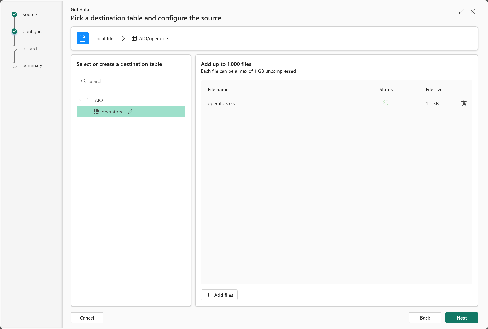
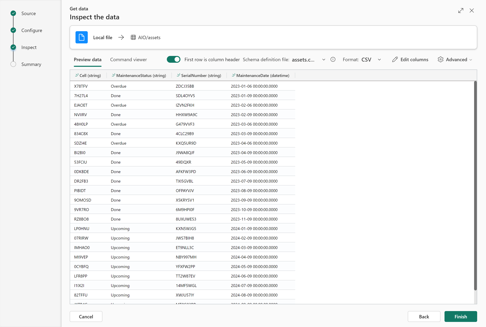
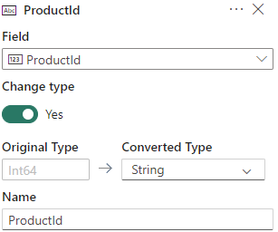
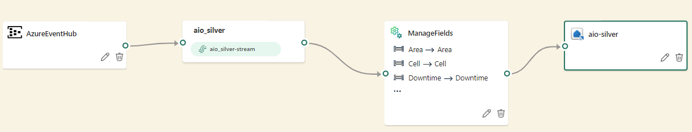

# Part 2 - Configure the solution in Microsoft Fabric

## Start a new Microsoft Fabric trial

- Open the [Fabric homepage](https://app.fabric.microsoft.com/home) and select the Account manager.
- In the Account manager, select Free trial. If you don't see Free trial or Start trial or a Trial status, trials aren't allowed for your tenant.

## Create database
- Select 'Real-Time Intelligence' from the [Fabric homepage](https://app.powerbi.com/home?experience=kusto).  

- Click on `Workspaces` > `New workspace` > type `Smart Factory` and click `Apply`
- Click `New` > `Eventhouse` > type `AIO` and click `Create`

## Create tables with reference data
- Click on `Workspaces` > `Smart Factory`
- Select the database `AIO` (type: `KQL Database`)
- Create the table for `operators` dataset
1. Click on `Get data` > `Local file` > `New table` > type `operators`
2. Upload the file [operators.csv](./artifacts/templates/fabric/reference-datasets/operators.csv) > `Next`  

3. Click on `First row is column header` > `Finish`, wait for the ingestion (status "Successfully ingested") and click `Close`

- Create the table for `assets` dataset
1. Click on `Get data` > `Local file` > `New table` > type `assets`
2. Upload the file [assets.csv](./artifacts/templates/fabric/reference-datasets/assets.csv) > `Next`  

3. Click on `First row is column header` > `Finish`, wait for the ingestion (status "Successfully ingested") and click `Close`

- Create the table for `products` dataset
1. Click on `Get data` > `Local file` > `New table` > type `products`
2. Upload the file [products.csv](./artifacts/templates/fabric/reference-datasets/products.csv) > `Next`  

3. Click on `First row is column header` > `Finish`, wait for the ingestion (status "Successfully ingested") and click `Close`

**Note**: the reference datasets will enable data enrichment in the Cloud with datasets in the Cloud (operators, assets and products manufactured).  

## Create table for silver data coming from Azure IoT Operations
- Select the query set `AIO_queryset`
- Add the following query:
    ```
    .create table aio_silver (
        Area: string,
        Cell: string,
        Downtime: double,
        EmployeeId: string,
        EnergyConsumption: double,
        Enterprise: string,
        GoodPartsCount: int64,
        IdealCycleTime: int64,
        Latitude: double,
        Line: string,
        Longitude: double,
        OperatingTime: int64,
        PlannedProductionTime: int64,
        ProductId: string,
        Shift: int64,
        ShiftHours: string,
        Site: string,
        Temperature: double,
        Timestamp: datetime,
        TotalPartsCount: int64,
        UNS: string,
        EventProcessedUtcTime: datetime,
        PartitionId: int64,
        EventEnqueuedUtcTime: datetime
    )
    ```
- Select the query portion and click `Run` to create the table `aio_silver`

## Create update function to enrich data stream with reference datasets
- Add the following query:
    ```
    .create function with(folder = 'UpdatePolicyFunctions') EnrichWithReferenceData() {
        ["aio_silver"]
        | join kind=inner ['assets'] on Cell
        | join kind=inner ['products'] on Cell
        | join kind=inner ['operators'] on EmployeeId
        | project Timestamp, Enterprise, Site, Area, Line, Cell, SerialNumber, MaintenanceStatus, MaintenanceDate, ProductId, ProductName, EmployeeId, Operator, OperatorPhone, OperatorEmail, PlannedProductionTime, OperatingTime, TotalPartsCount, GoodPartsCount, IdealCycleTime, Downtime, EnergyConsumption, Temperature, Shift, ShiftHours, UNS, Latitude, Longitude
    }
    ```
- Select the query portion and click `Run` to create the function

## Create table for gold data enriched with cloud reference datasets (directory and maintenance)
- Add the following query:
    ```
    .set aio_gold <| 
    EnrichWithReferenceData()
    ```
- Select the query portion and click `Run` to create the table `aio_gold`
- You should now see 5 tables:  


## Disable streaming ingestion
- Select the query set `AIO_queryset`
- Add the following query:
    ```
    .alter table aio_silver policy streamingingestion disable
    ```
- Select the query portion and click `Run`

## Activate the update policy
- Add the following query:
    ```
    .alter table aio_gold policy update 
    @'[{ "IsEnabled": true, "Source": "aio_silver", "Query": "EnrichWithReferenceData()", "IsTransactional": false, "PropagateIngestionProperties": false}]'
    ```
- Select the query portion and click `Run`

## Authorize the Factory Agent to query the database
   - Retrieve the environment following variables you defined in [Part 1 - Provision resources (Edge and Cloud)](./INSTALL-1.md) ==> file `variables.yaml`:
     ```bash
     FACTORY_AGENT_SP_APPID
     TENANT
     ```
- Add the following query:
    ```
    .add database AIO viewers ('aadapp=<FACTORY_AGENT_SP_APPID>;<TENANT>') "Gen AI Factory Agent"
    ```
- Select the query portion and click `Run`

## Authorize the Factory Agent to query the table
   - Retrieve the environment following variables you defined in [Part 1 - Provision resources (Edge and Cloud)](./INSTALL-1.md) ==> file `variables.yaml`:
     ```bash
     FACTORY_AGENT_SP_APPID
     TENANT
     ```
- Add the following query:
    ```
    .add table aio_gold admins ('aadapp=<FACTORY_AGENT_SP_APPID>;<TENANT>') "Gen AI Factory Agent"
    ```
- Select the query portion and click `Run`

## Create the event stream to ingest data from Azure Event Hub to a database in Microsoft Fabric
1. Configure event stream source
    - Click on `Workspaces` > `Smart Factory`
    - `New` > `Eventstream` > choose the name `aio_silver` and click `Create`
    - Click on `Add source` > `External sources` > `Azure Event Hubs` > `Connect`
    - Create new connection
    - Retrieve variables created in [Part 1 - Provision resources (Edge and Cloud)](./INSTALL-1.md) ==> file `variables.yaml`
    - `Event Hub namespace` > `EVENTHUB_NAMESPACE` variable
    - `Event Hub` > `EVENTHUB_NAME` `
    - Choose a connection name
    - `Shared Access Key Name` > `Listen`
    - `Shared Access Key` > `EVENTHUB_KEY` variable
    - Check that the connection name is correct
    - Tick the box `Test connection` and click `Connect`
    - `Consumer group` > type `Fabric`
    - `Data format` > select `Json`
    - `Next` > `Add`

2. Configure event stream data transformation
    - Click on `Transform events` >  `Manage fields`
    - Connect event stream node to `ManageFields` node
    - Click on the pencil > `Add all fields`
    - Set the field `EmployeeId` to `String` (click on the three dots) > `Change type` > `Yes`  
       
    - Set the field `ProductId` to `String`  > `Change type` > `Yes`  
     
    - Set the field `Timestamp` to `DateTime`  > `Change type` > `Yes`  
     

3. Configure event stream destination
    - Click on `Add destination` >  `Eventhouse`
    - Tick the box `Event processing before ingestion`
    - Choose a `Destination name`
    - `Workspace` > select `Smart Factory`
    - `Eventhouse` > select `AIO`
    - `KQL Database` > select the database `AIO`
    - `KQL Destination table` > select `aio_silver`
    - `Input data format` > `Json`
    - Tick the box `Activate streaming after adding data source` > `Save`
    - Connect `ManageFields` node to Destination node
    - Click `Save`  
     
    - Click `Publish` to start the Eventstream

- ✅ **You can now continue to** > [Part 3 - Deploy and use the Generative AI Factory Agent](./INSTALL-3.md)