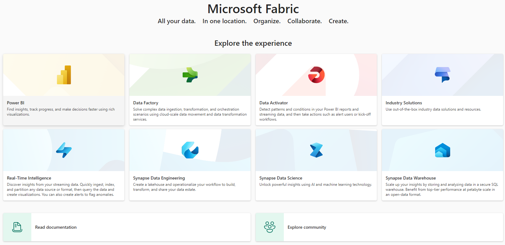
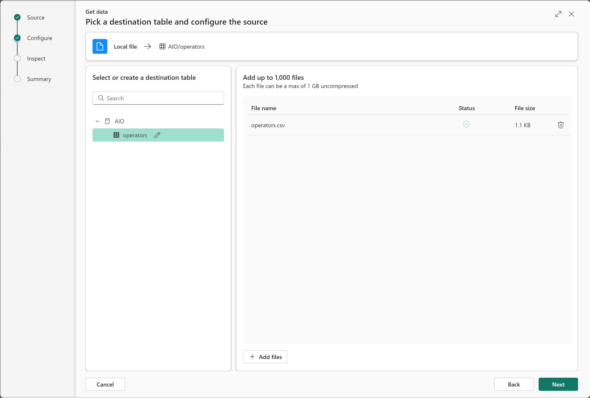
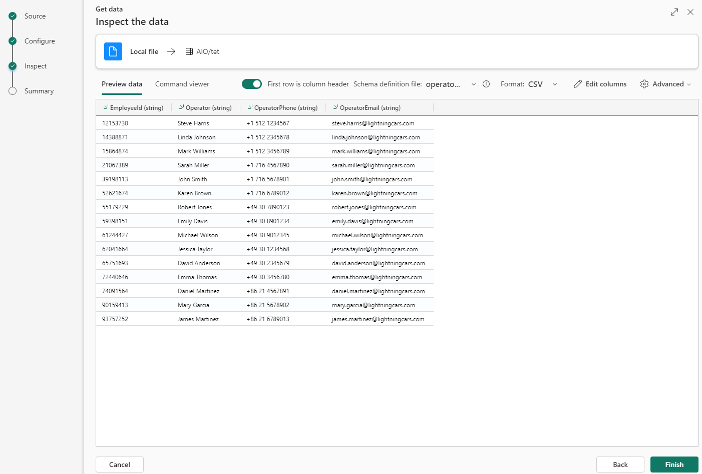
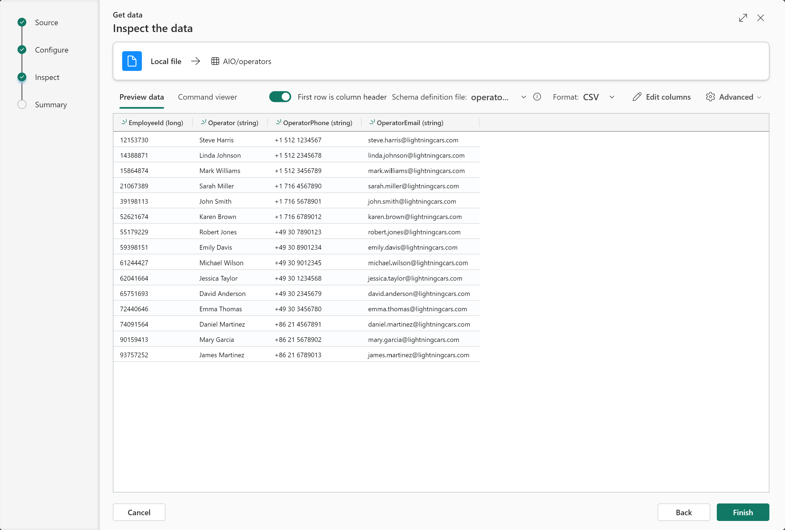
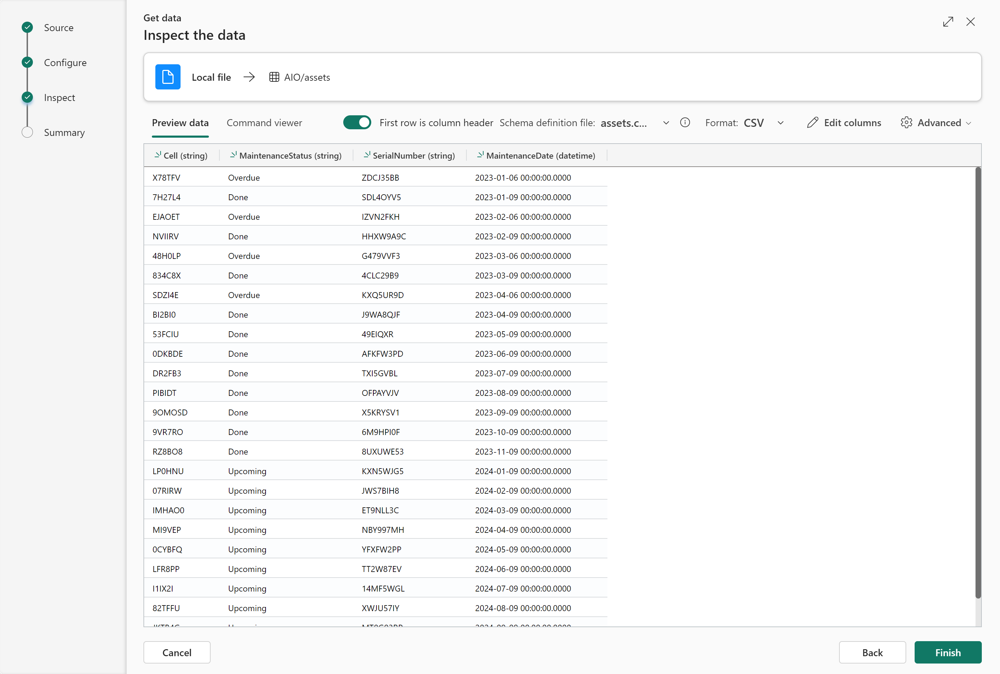
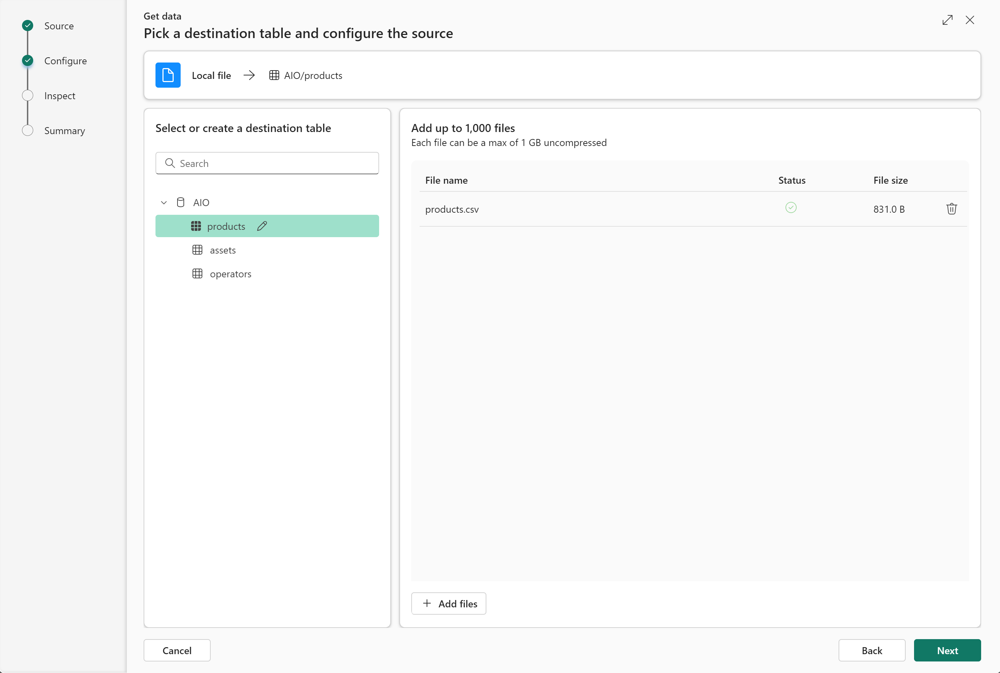
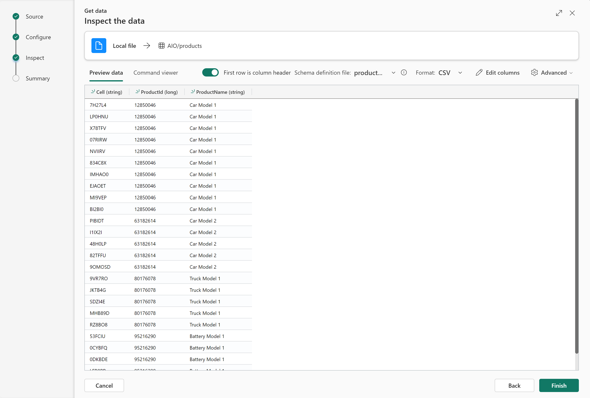
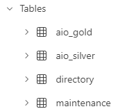
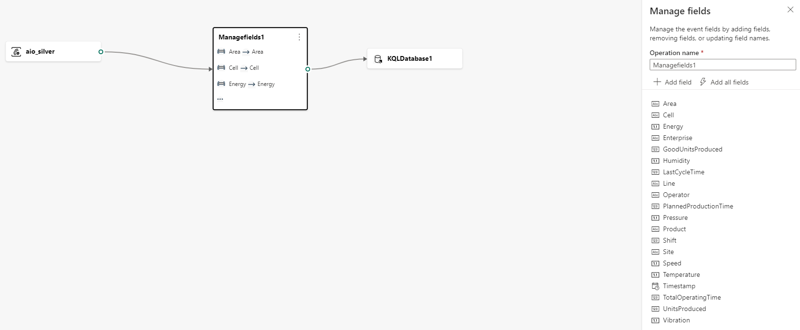
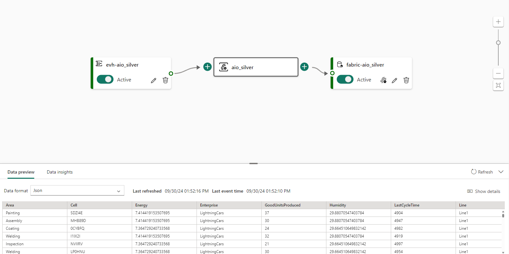

### Part 3 - Configure the solution (Cloud part)

#### Start a new Microsoft Fabric trial

- Open the [Fabric homepage](https://app.fabric.microsoft.com/home) and select the Account manager.
- In the Account manager, select Free trial. If you don't see Free trial or Start trial or a Trial status, trials aren't allowed for your tenant.

#### Create database
- Select 'Real-Time Intelligence' from the [Fabric homepage](https://app.powerbi.com/home?experience=kusto).  

- Click on `Workspaces` > `New workspace` > type `Smart Factory` and click `Apply`
- Click `New` > `Eventhouse` > type `AIO` and click `Create`

#### Create tables with reference data
- Click on `Workspaces` > `Smart Factory`
- Select the database `AIO` (type: `KQL Database`)
- Create the table for `operators` dataset
1. Click on `Get data` > `Local file` > `New table` > type `operators`
2. Upload the file [operators.csv](./artifacts/templates/fabric/reference-datasets/operators.csv) > `Next`  

3. Click on `Edit columns` > set `EmployeeId` column as Type `string` and click `Apply`

4. Click on `First row is column header` > `Finish`, wait for the ingestion (status "Successfully ingested") and click `Close`

- Create the table for `assets` dataset
1. Click on `Get data` > `Local file` > `New table` > type `assets`
2. Upload the file [assets.csv](./artifacts/templates/fabric/reference-datasets/assets.csv) > `Next`  

3. Click on `First row is column header` > `Finish`, wait for the ingestion (status "Successfully ingested") and click `Close`

- Create the table for `products` dataset
1. Click on `Get data` > `Local file` > `New table` > type `products`
2. Upload the file [products.csv](./artifacts/templates/fabric/reference-datasets/products.csv) > `Next`  

3. Click on `First row is column header` > `Finish`, wait for the ingestion (status "Successfully ingested") and click `Close`

**Note**: the reference datasets will enable data enrichment in the Cloud with datasets in the Cloud (operators, assets and products manufactured).  

#### Create table for silver data coming from Azure IoT Operations
- Select the query set `AIO_queryset`
- Add the following query:
    ```
    .create table aio_silver (
        Timestamp: datetime,
        UNS: string,
        Enterprise: string,
        Site: string,
        Area: string,
        Line: string,
        Cell: string,
        Latitude: real,
        Longitude: real,
        PlannedProductionTime: real,
        OperatingTime: real,
        TotalPartsCount: real,
        GoodPartsCount: real,
        IdealCycleTime: real,
        Downtime: real,
        EnergyConsumption: real,
        Temperature: real,
        Shift: real,
        ShiftHours: string, 
        EmployeeId: real,
        ProductId: real
    )
    ```
- Select the query portion and click `Run` to create the table `aio_silver`

#### Create update function to enrich data stream with reference datasets
- Add the following query:
    ```
    .create function with(folder = 'UpdatePolicyFunctions') EnrichWithReferenceData() {
        ["aio_silver"]
        | join kind=inner ['assets'] on Cell
        | join kind=inner ['products'] on Cell
        | join kind=inner ['operators'] on EmployeeId
        | project Timestamp, Enterprise, Site, Area, Line, Cell, SerialNumber, MaintenanceStatus, MaintenanceDate, ProductId, ProductName, EmployeeId, Operator, OperatorPhone, OperatorEmail, PlannedProductionTime, OperatingTime, TotalPartsCount, GoodPartsCount, IdealCycleTime, Downtime, EnergyConsumption, Temperature, Shift, ShiftHours, UNS, Latitude, Longitude
    }
    ```
- Select the query portion and click `Run` to create the function

#### Create table for gold data enriched with cloud reference datasets (directory and maintenance)
- Add the following query:
    ```
    .set aio_gold <| 
    EnrichWithReferenceData()
    | limit 0
    ```
- Select the query portion and click `Run` to create the table `aio_gold`
- You should now see 4 tables:  


#### Disable streaming ingestion
- Add the following query:
    ```
    .alter table aio_silver policy streamingingestion disable
    ```
- Select the query portion and click `Run`

#### Activate the update policy
- Add the following query:
    ```
    .alter table aio_gold policy update 
    @'[{ "IsEnabled": true, "Source": "aio_silver", "Query": "EnrichWithReferenceData()", "IsTransactional": false, "PropagateIngestionProperties": false}]'
    ```
- Select the query portion and click `Run`

#### Authorize the Factory Assistant to query the database
   - Retrieve the environment following variables you defined in [Part 1 - Provision resources (Edge and Cloud)](./INSTALL-1.md) ==> **Note(2)**:
     ```bash
     $ASSISTANT_APP_ID
     $ASSISTANT_TENANT
     ```
- Add the following query:
    ```
    .add database <YOUR_DATABASE> viewers ('aadapp=<ASSISTANT_APP_ID>;<ASSISTANT_TENANT>') "Gen AI Factory Assistant"
    ```
- Select the query portion and click `Run`

#### Authorize the Factory Assistant to query the table
   - Retrieve the environment following variables you defined in [Part 1 - Provision resources (Edge and Cloud)](./INSTALL-1.md) ==> **Note(2)**:
     ```bash
     $ASSISTANT_APP_ID
     $ASSISTANT_TENANT
     ```
- Add the following query:
    ```
    .add table aio_gold admins ('aadapp=<ASSISTANT_APP_ID>;<ASSISTANT_TENANT>') "Gen AI Factory Assistant"
    ```
- Select the query portion and click `Run`

#### Create the event stream to ingest data from Azure Event Hub to a database in Microsoft Fabric
1. Configure event stream source
    - Click on `Workspaces` > `Smart Factory`
    - `New` > `Eventstream` > choose the name `aio_silver` and click `Create`
    - Click on `New source` > `Azure Event Hubs`
    - Choose a `Source name`
    - `Cloud connection` > `Create new`
    - Retrieve variables created in [Part 1 - Provision resources (Edge and Cloud)](./INSTALL-1.md) ==> **Note(1)**
    - `Event Hub namespace` > `$EVENTHUB_NAMESPACE` variable
    - `Event Hub` > `$EVENTHUB_NAME` variable
    - `Shared Access Key Name` > `$EVENTHUB_KEYNAME` variable
    - `Shared Access Key` > `$EVENTHUB_KEY` variable
    - Click `Create`
    - Check if the event hub is select in `Cloud connection`
    - `Consumer group` > `Create new` > type `Fabric` and click `Done`
    - `Data format` > select `Json`
    - Tick the box `Activate streaming after adding data source` and click `Add`

2. Configure event stream destination
    - Click on `New destination` > `KQL Database`
    - Select `Event processing before ingestion`
    - Choose a `Destination name`
    - `Workspace` > select `Smart Factory`
    - `KQL Database` > select your database
    - `Destination table` > select `aio_silver`
    - `Input data format` > `Json`
    - Tick the box `Activate streaming after adding data source` and click `Add`

3. Configure fields mapping
    - Click `Open event processor`
    - A new wizard will open
    - Select `aio_silver` > `+ (plus sign)` > `Manage fields`
    - `Operation name` > keep `Managefields1`
    - Click `Add all fields`
    - Go to the end of the list of fields and remove the 3 following fields:
        - `EventProcessedUtcTime`
        - `PartitionId`
        - `EventEnqueuedUtcTime`
        - (`...` and `Remove`)
        
        - Click `Done` twice
    - Click `Add`

        

#### Confirm that the Data stream is connected
- Click on `Workspaces` > `Smart Factory`
- Select the database created (type: `KQL Database`)
- Click on `Data stream` and confirm the Status is `Connected`

- ✅ **You can now continue to** > [Part 4 - Deploy and use the Generative AI Factory Assistant](./INSTALL-4.md)