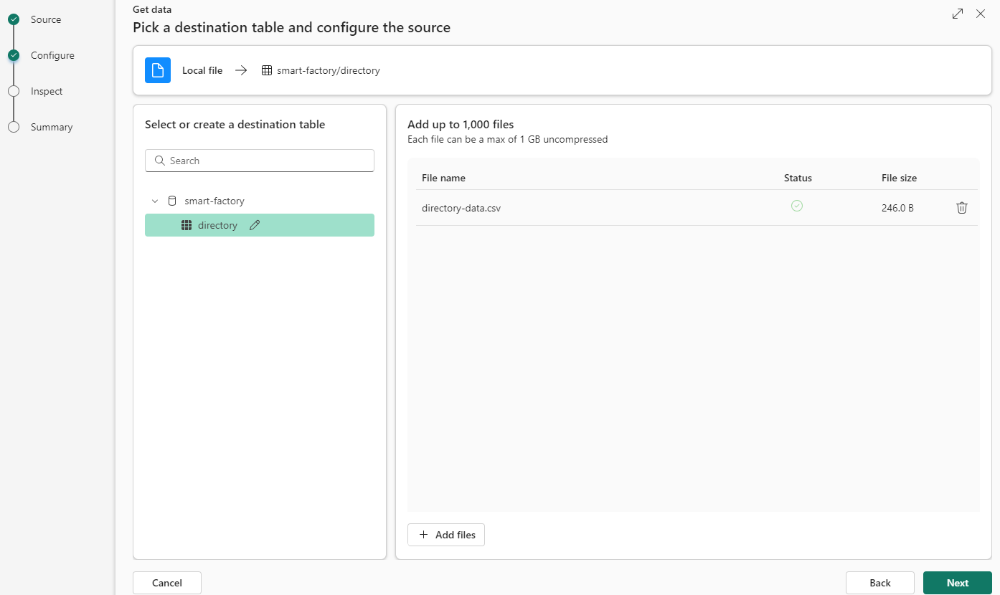
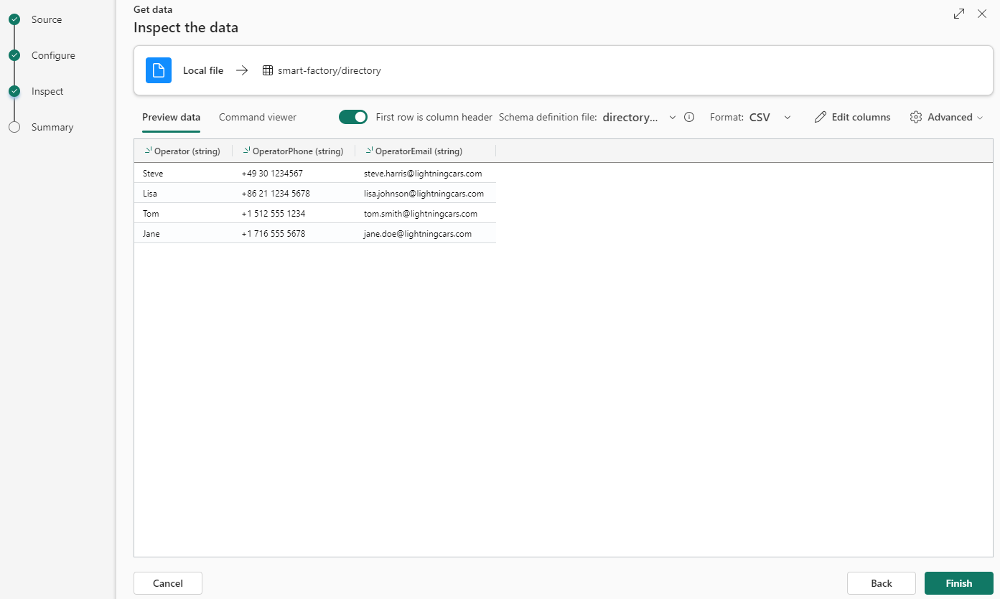
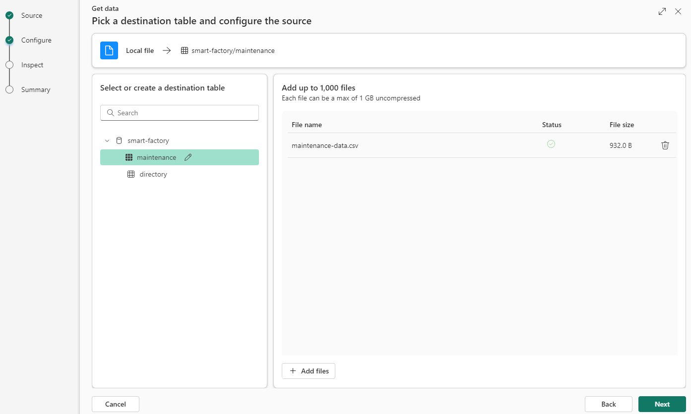
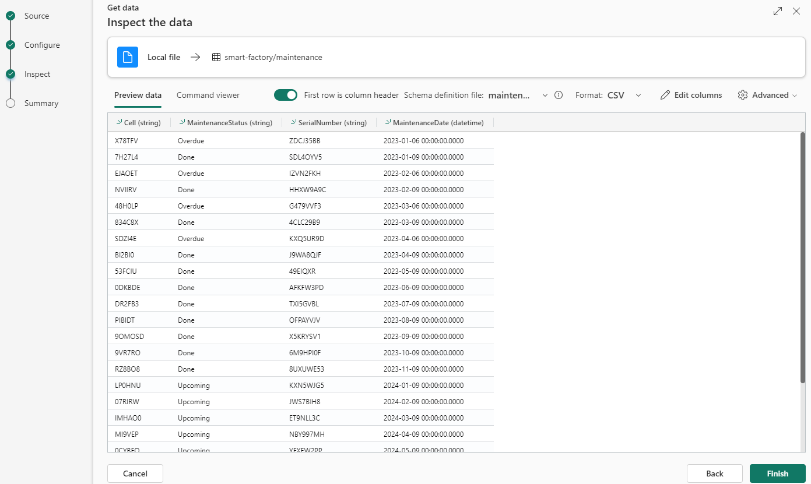

### Part 3 - Configure the solution (Cloud part)

#### Start a new Microsoft Fabric trial

- Open the [Fabric homepage](https://app.fabric.microsoft.com/home) and select the Account manager.
- In the Account manager, select Free trial. If you don't see Free trial or Start trial or a Trial status, trials aren't allowed for your tenant.

#### Create database
- Select 'Real-Time Intelligence' from the [Fabric homepage](https://app.powerbi.com/home?experience=kusto).  

- Click on `Workspaces` > `My workspace`
- `New` > `Eventhouse` > choose a name and click `Create`

#### Create tables with reference data
- Click on `Workspaces` > `My workspace`
- Select the database created (type: `KQL Database`)
- Create the table for directory dataset
1. Click on `Get data` > `Local file` > `New table` > type `directory`
2. Upload the file [directory-data.csv](./artifacts/templates/fabric/reference-datasets/directory-data.csv) > `Next`  

3. Click on `First row is column header` > `Finish` and `Close`

- Repeat the same steps for maintenance dataset
1. Click on `Get data` > `Local file` > `New table` > type `maintenance`
2. Upload the file [maintenance-data.csv](./artifacts/templates/fabric/reference-datasets/maintenance-data.csv) > `Next`  

3. Click on `First row is column header` > `Finish` and `Close`

**Note**: the reference datasets will enable data enrichment in the Cloud with datasets in the Cloud (scenario with Company Directory Information and ERP in the Cloud).  

#### Create table for silver data coming from Azure IoT Operations
- Click on `Workspaces` > `My workspace`
- Select the query set (type: `KQL Queryset`)
- Clear the text in the query set and replace by the following query:
    ```
    .create table aio_silver (
    Timestamp: datetime,
    Enterprise: string,
    Site: string,
    Area:string,
    Line: string,
    Cell:string,
    LastCycleTime: real,
    TotalOperatingTime: real,
    PlannedProductionTime: real,
    Temperature: real,
    Humidity: real,
    Pressure: real,
    Speed: real,
    Vibration: real,
    Energy: real,
    Product: string,
    Operator: string,
    Shift: real,
    UnitsProduced: real,
    GoodUnitsProduced: real)
    ```
- Click `Run` to create the table `aio_silver`

#### Create update function to enrich data stream with reference datasets
- Clear the text in the query set and replace by the following query:
    ```
    .create function with(folder = 'UpdatePolicyFunctions') EnrichWithReferenceData() {
        ["aio_silver"]
        | join kind=fullouter ['maintenance'] on Cell
        | join kind=fullouter ['directory'] on Operator
        | project Timestamp, Enterprise, Site, Area, Line, Cell, SerialNumber, MaintenanceStatus, MaintenanceDate, Operator, OperatorPhone, OperatorEmail, Shift, Product, LastCycleTime, TotalOperatingTime, PlannedProductionTime, UnitsProduced, GoodUnitsProduced, Energy, Temperature, Humidity, Pressure, Vibration, Speed
    }
    ```
- Click `Run` to create the function

#### Create table for gold data enriched with cloud reference datasets (directory and maintenance)
- Clear the text in the query set and replace by the following query:
    ```
    .set aio_gold <| 
    EnrichWithReferenceData()
    | limit 0
    ```
- Click `Run` to create the table `aio_gold`
- You should now see 4 tables:  


#### Activate the update policy
- Clear the text in the query set and replace by the following queries:
    ```
    .alter table aio_silver policy streamingingestion disable

    .alter table aio_gold policy update 
    @'[{ "IsEnabled": true, "Source": "aio_silver", "Query": "EnrichWithReferenceData()", "IsTransactional": false, "PropagateIngestionProperties": false}]'

    .alter table aio_silver policy streamingingestion enable
    ```
- Click `Run`

#### Authorize the Factory Assistant to query the database
   - Retrieve the environment following variables you defined in [Part 1 - Provision resources (Edge and Cloud)](./INSTALL-1.md) ==> **Note(2)**:
     ```bash
     $ASSISTANT_APP_ID
     $ASSISTANT_TENANT
     ```
- Clear the text in the query set and replace by the following query:
    ```
    .add database <YOUR_DATABASE> viewers ('aadapp=<ASSISTANT_APP_ID>;<ASSISTANT_TENANT>') "Gen AI Factory Assistant"
    .add table aio_gold admins ('aadapp=<ASSISTANT_APP_ID>;<ASSISTANT_TENANT>') "Gen AI Factory Assistant"
    ```
- Click `Run`

#### Create the event stream to ingest data from event hub to a database
- Click on `Workspaces` > `My workspace`
- `New` > `Eventstream` > choose a name and click `Create`
- Click on `New source` > `Azure Event Hubs`
- Choose a `Source name`
- `Cloud connection` > `Create new`
- Retrieve variables created in [Part 1 - Provision resources (Edge and Cloud)](./INSTALL-1.md) ==> **Note(1)**
- `Event Hub namespace` > `$EVENTHUB_NAMESPACE` variable
- `Event Hub` > `$EVENTHUB_NAME` variable
- `Shared Access Key Name` > `$EVENTHUB_KEYNAME` variable
- `Shared Access Key` > `$EVENTHUB_KEY` variable
- Click `Create`
- Check if the event hub is select in `Cloud connection`
- `Consumer group` > `Create new` > type `Fabric` and click `Done`
- `Data format` > select `Json`
- Tick the box `Activate streaming after adding data source` and click `Add`
- Click on `New destination` > `KQL Database`
- Select `Direct ingestion`
- Choose a `Destination name`
- `Workspace` > select `My workspace`
- `KQL Database` > select your database and click `Add and configure`
- A new wizard will open > select the table `aio_silver`, click `Next`, `Finish` and `Close`

#### Confirm that the Data stream is connected
- Click on `Workspaces` > `My workspace`
- Select the database created (type: `KQL Database`)
- Click on `Data stream` and confirm the Status is `Connected`


- ✅ **You can now continue to** > [Part 4 - Deploy and use the Generative AI Factory Assistant](./INSTALL-4.md)