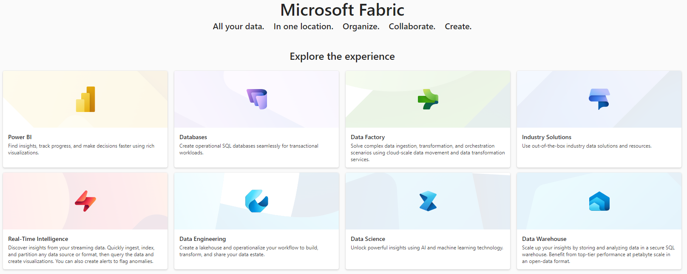

### Part 3 - Configure the solution (Cloud part)

#### Start a new Microsoft Fabric trial

1. Open the [Fabric homepage](https://app.fabric.microsoft.com/home) and select the Account manager.
2. In the Account manager, select Free trial. If you don't see Free trial or Start trial or a Trial status, trials aren't allowed for your tenant.

#### Configure Fabric
1. Select 'Real-Time Intelligence' from the [Fabric homepage](https://app.fabric.microsoft.com/home).  

2. Click on 'Workspaces' > `My workspace`
3. New > `Eventhouse` > choose a name and click 'Create'
4. It will create a new Database