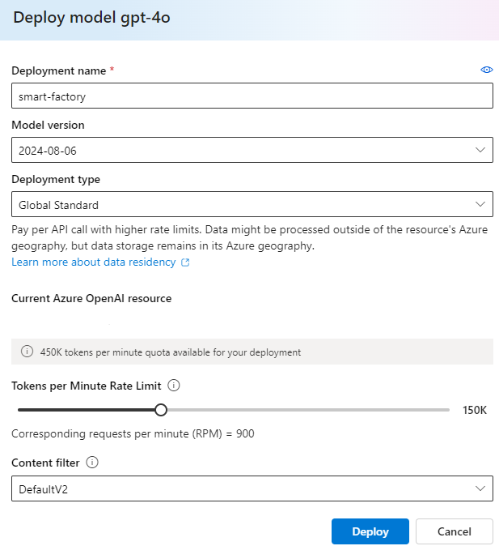

### Part 4 - Deploy and use the Generative AI Factory Assistant

#### Deploy a Large Language Model (LLM) in Azure Open AI
   - [Deploy a base model](https://learn.microsoft.com/en-us/azure/ai-services/openai/how-to/create-resource?pivots=web-portal#deploy-a-model):
      - Login to [Azure OpenAI Studio](https://oai.azure.com/) > `Deployments` > `Deploy model` > `Deploy base model`
      - Select `gpt-4o` > click `Confirm`
      - Deployment Name: `smart-factory`
      - Model version: `2024-08-06`
      - Deployment type: `Global Standard`
      - Tokens per Minute Rate Limit: `150K`
      - Content filter: `DefaultV2`
      - Click `Deploy`

        

      - Once the model is deployed, note the following information from the `Deployment info` panel:
      - `Endpoint` > `Target URI` (copy the name, for example: `https://aoai123456.openai.azure.com`)

#### Create an environment variable file
- Rename the file [`.env_template`](./artifacts/factory-assistant/.env_template) to `.env`
    ```bash
    mv .env_template .env
    ```
- Retrieve the environment following variables you defined in [Part 1 - Provision resources (Edge and Cloud)](./INSTALL-1.md) ==> **Note(2)**:
    ```bash
    $ASSISTANT_APP_ID
    $ASSISTANT_APP_SECRET
    $ASSISTANT_TENANT
    $AZURE_OPENAI_KEY
    ```
- Retrieve the Fabric endpoint from [Fabric homepage](https://app.fabric.microsoft.com/home) > `Settings` > `Manage connections and gateways`
- `Connections` > copy the name of your Fabric endpoint (Connection type: `Azure Data Explorer (Kusto)`)
- Modify environment variables in `.env` file
    ```bash
    AZURE_OPENAI_ENDPOINT           = < YOUR OPEN AI ENDPOINT IN AZURE > # for example: https://aoai123456.openai.azure.com
    AZURE_OPENAI_API_KEY            = < VALUE OF $AZURE_OPENAI_KEY VARIABLE >
    AZURE_OPENAI_DEPLOYMENT_NAME    = "smart-factory"
    AZURE_OPENAI_MODEL_NAME         = "gpt-4o"
    AZURE_OPENAI_DEPLOYMENT_VERSION = "2024-08-06"

    AZURE_AD_TENANT_ID              = < VALUE OF $ASSISTANT_TENANT VARIABLE >
    KUSTO_CLUSTER                   = < YOUR FABRIC ENDPOINT >
    KUSTO_MANAGED_IDENTITY_APP_ID   = < VALUE OF $ASSISTANT_APP_ID VARIABLE >
    KUSTO_MANAGED_IDENTITY_SECRET   = < VALUE OF $ASSISTANT_APP_SECRET VARIABLE >
    KUSTO_DATABASE_NAME             = < YOUR_DATABASE >
    KUSTO_TABLE_NAME                = "aio_gold"
    ```

#### Start the Factory Assistant Application
- Start a terminal from the [directory](./artifacts/factory-assistant/)
- Execute the following commands:
    ```bash
    pip install -r requirements.txt
    streamlit run .\frontend.py
    ```
- Launch a browser with the following URL to access the application:
    ```
    http://localhost:8501/
    ```
- You can now query the database using Natural Language  
**Note**: **no data from the database is transmitted to the Large Language Model** in Azure Open AI, but only the prompt, and the model will return the appropriate query to execute.  
- Some example queries are provided as examples.

    