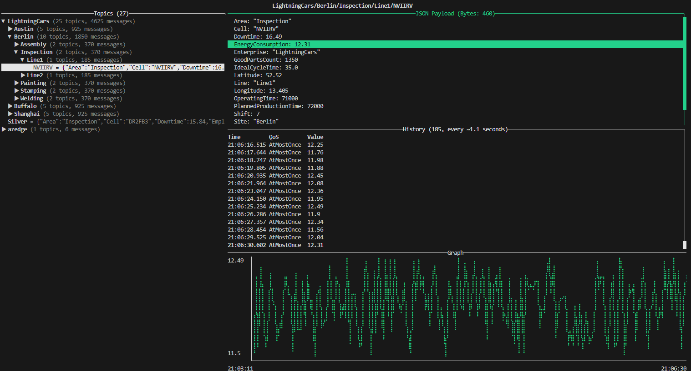
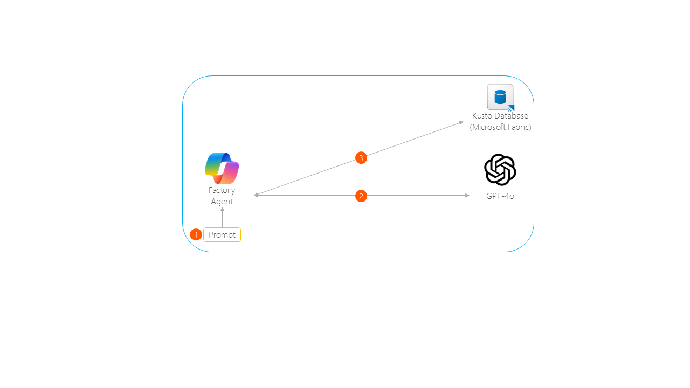

# 🗣️ Talk to your Factory

## Introduction

Welcome to the "Talk to your Factory" project, a fascinating open-source initiative that allows you to control and interact with industrial equipment using natural language processing (NLP), Edge and Cloud technologies.

What's about? The project aims to bridge the gap between humans and industrial machines by enabling people to communicate with factory equipment using simple text inputs.

See how the Smart Factory leverages Generative AI to optimize its operations!

## Technology

🏭 Real-time ingestion and processing of operational data (OT): operators, manufactured products, and machine maintenance schedules.  
🤖 Data processing: Edge and Cloud, with a Semantic Kernel & Generative AI model to power the Factory Agent, for smarter interactions.

### Key features and benefits

- **Data Processing**: Data structure following a **Medallion Architecture**, with the goal of incrementally and progressively improving the structure and quality of data as it flows through each layer of the architecture.  
From `Bronze` (Edge: MQTT Data Simulator) ⇒ `Silver` (Edge: Azure IoT Operations) ⇒ `Gold` (Cloud: Microsoft Fabric) layer tables.

- **Natural Language Processing (NLP)**: a Factory Agent, enhanced by Generative AI, empowers operators, so they can ask complex questions about machine operations, staff, production quality, as if they were speaking to a human expert in the Factory.

## Architecture

### Solution architecture overview


### Factory simulation


### Key components


1. [**Factory Simulator**](./artifacts/mqtt-data-simulator/README.md)  
    Simulates data coming from several factories: Berlin, Austin, Buffalo, Shanghai.  
    Factory simulator is publishing data to an Message Queuing Telemetry Transport (MQTT) broker topic based on the international standard from the International Society of Automation known as 'ISA-95' with the following format: Enterprise/Site/Area/Line/Cell.  
    Industrial machines involved in the process are 'Cells.'  

    > Messages are published following the **UNS (Unified Namespace) Architecture**.  
    The UNS is a method of organizing and structuring data in a way that makes it accessible and meaningful across an entire enterprise.  
    

2. [**Azure IoT Operations**](https://learn.microsoft.com/en-us/azure/iot-operations/overview-iot-operations)  
    Processes data at Edge: normalize, contextualize, enrich with Edge reference datasets (Operators and Products).

3. [**Azure Event Hub**](https://learn.microsoft.com/en-us/azure/event-hubs/event-hubs-about)  
    Data ingestion in Azure.     
    
4. [**Microsoft Fabric Real-Time Intelligence**](https://learn.microsoft.com/en-us/fabric/real-time-intelligence/overview)  
    Processes data in Azure: materialize data as a Table, enrich with Cloud reference datasets (Operators, Assets and Products).

5. [**Generative AI Factory Agent**](https://learn.microsoft.com/en-us/azure/ai-services/openai/overview)  
    Introducing a custom Large Language Model (LLM) Factory Agent, based on OpenAI model 'GPT-4o', that enables natural language communication with the factory. This agent simplifies the process of retrieving information from various systems and databases.

### Communication flow


1. **User Prompt**: user asks a question to the Factory Agent.  
    The graphical user interface is based on the open-source framework [`Streamlit`](https://streamlit.io/).
2. **Custom Large Language Model (LLM)**: analyzes the prompt and generate the corresponding query to be executed to the database in Microsoft Fabric.  
3. [**Semantic Kernel**](https://aka.ms/semantic-kernel): execute query and return results (Python application).

#### Creating complex queries from natural language prompt - Example


1. **Prompt**: _"Determine the yield percentage for each Site this month by comparing the total units produced to the number of good units produced."_
2. **Generative AI Model**: analyzes the prompt and generate the corresponding query to be executed to the database.  

    > **IMPORTANT**: No actual data from the database is transmitted to the Large Language Model; only the prompt and the database schema are shared. The LLM will generate the query to be executed against the database, but it won't execute the query itself.  

    Example query generated in `KQL (Kusto Query Language)`:  
    ```
    aio_gold
    | where Timestamp >= startofmonth(now())
    | summarize TotalUnitsProduced = sum(TotalPartsCount), GoodUnitsProduced = sum(GoodPartsCount) by Site
    | extend YieldPercentage = (GoodUnitsProduced / TotalUnitsProduced) * 100
    | project Site, YieldPercentage
    | limit 100
    ```  

3. **Back-end application `(Python)`**: queries the database to retrieve results.  

4. **Front-end application `(Streamlit)`**: provides the user interface.

## Prerequisites
Microsoft Documentation: [Azure IoT Operations prerequisites](https://learn.microsoft.com/en-us/azure/iot-operations/deploy-iot-ops/howto-prepare-cluster?tabs=ubuntu)

### Hardware requirements

- **Resources**: 
    - CPU: `4 vCPU`
    - Memory: `16GB`
    - Storage: `30GB`

- **Operating System**: the solution requires a Linux-based system, specifically a VM or physical machine running `Linux Ubuntu 24.04`. This system will perform as an Edge server, handling queries directly from the production line and interfacing with other operational systems.

### Software requirements

 - [`K3s`](https://k3s.io/) Lightweight Kubernetes. Easy to install, half the memory, all in a binary of less than 100 MB.
 - [`python >=v3.10`](https://www.python.org/) Programming Language
 - [`Azure CLI`](https://learn.microsoft.com/en-us/cli/azure/) the Azure command-line interface.
 - [`Ansible`](https://www.ansible.com/) open source IT automation engine that automates provisioning and configuration of the solution.

### Cloud services requirements

 - Azure Subscription (with Contributor rights)
 - The solution will deploy the following resources:
    - Resource Group
    - Storage Account
    - Schema Registry
    - Event Hub
    - Azure Open AI Service
    - 2 Managed Identities
    - _Optional_: Virtual Machine (if you want to test everything in Azure Cloud)
 - Microsoft Fabric Tenant (you can try it for free [here](https://www.microsoft.com/en-us/microsoft-fabric/getting-started?msockid=27cd43526f4e6b2a1fa857d06e486a3c))

## Solution build steps

Deploy the solution in 3 steps!

### 1. [Provision resources (Edge and Cloud)](./INSTALL-1.md)
### 2. [Configure the solution (Cloud part)](./INSTALL-2.md)
### 3. [Deploy and use the Generative AI Factory Agent](./INSTALL-3.md)

## Demo


## Videos

- **IoT Show** hosted by `Olivier Bloch`  
  [](https://www.youtube.com/embed/-AxWwJU_G_U)  
- **Azure Arc Jumpstart** hosted by `Lior Kamrat`  
  [](https://www.youtube.com/embed/cN6urmB_7jY)