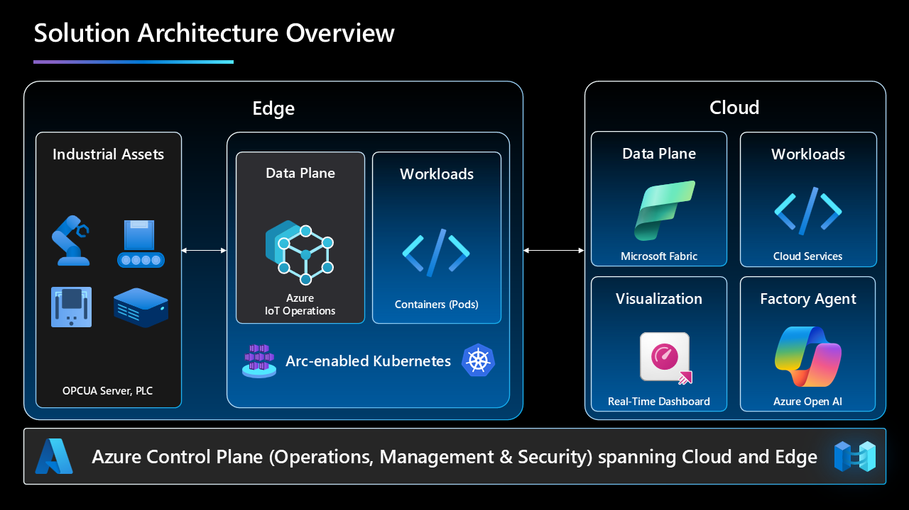
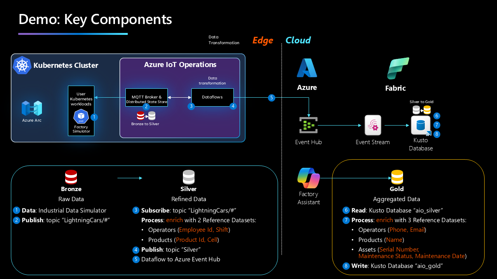

# 🗣️ Talk to your factory - implementation guide (work in progress)

## Introduction
🤖 Smart Factory demo, enhanced by Generative AI.  
🏭 See how the Smart Factory leverages Generative AI to optimize its operations!  
🔍 Real-time ingestion and processing of operations data (OT): operators, manufactured products, and machine maintenance schedules.  
🗣️ Data processing: Edge and Cloud, with a Semantic Kernel to power the Factory Assistant, for smarter interactions.  

[Video on the IoT Show](https://youtu.be/-AxWwJU_G_U?feature=shared), Demo starts at [19:54](https://youtu.be/-AxWwJU_G_U?feature=shared&t=1194)

### Key features and benefits

- **Data Processing**: Data structure following a `Medallion Architecture`, with the goal of incrementally and progressively improving the structure and quality of data as it flows through each layer of the architecture.  
From `Bronze` (Edge/Simulator) ⇒ `Silver` (Edge/Azure IoT Operations Data Processor) ⇒ `Gold` (Cloud/Fabric) layer tables.

- **Natural Language Processing**: a Smart Assistant, enhanced by Generative AI, empowers operators, so they can ask complex questions about machine operations, staff, production quality, as if they were speaking to a human expert in the Factory.

## Architecture

### Solution architecture overview



### Factory simulation


### Key components



1. **Factory Simulator**  
    Simulates data coming from several factories: Berlin, Austin, Buffalo, Shanghai.  
    Factory simulator is publishing data to an Message Queuing Telemetry Transport (MQTT) broker topic based on the international standard from the International Society of Automation known as 'ISA-95' with the following format: Enterprise/Site/Area/Line/Cell.  
    Industrial machines involved in the process are 'Cells.'  

2. **Azure IoT Operations**  
    Processes data at Edge: normalize, contextualize, enrich with Edge reference datasets (Operator Data, Production Data) and aggregate every minute.

3. **Azure Event Hub**  
    Data ingestion in Azure.     
    
4. **Microsoft Fabric**  
    Processes data in Azure: materialize data as a Table, enrich with Cloud reference datasets (Maintenance Data, Directory Data).

5. **Generative AI Factory Assistant**  
    Introducing a custom Large Language Model (LLM) Factory Assistant, based on OpenAI model 'GPT-4o', that enables natural language communication with the factory. This assistant simplifies the process of retrieving information from various systems and databases.

### Communication flow


- **User Prompt**: user asks a question to the Factory Assistant.
- **Custom LLM Large Language Model (LLM) Factory Assistant**: analyze prompt and write the statement to query the Database in Fabric.
- **Semantic Kernel**: execute query in background and return results (Python code).
- **Web Application**: provide the graphical user interface (based on the open-source framework 'Streamlit').

## Pre-requisites

### Hardware requirements

1. **Resources**: 
    - **CPU**: 4 vCPU
    - **Memory**: 16GB
    - **Storage**: 30GB

2. **Operating System**: the solution requires a Linux-based system, specifically a VM or physical machine running **Linux Ubuntu 22.04**. This system will perform as an edge server, handling queries directly from the production line and interfacing with other operational systems.

### Software requirements

 - [Azure CLI](https://learn.microsoft.com/en-us/cli/azure/) the Azure command-line interface.
 - [K3s](https://k3s.io/) Lightweight Kubernetes. Easy to install, half the memory, all in a binary of less than 100 MB.
 - [curl](https://curl.se/) command line tool that developers use to transfer data to and from a server.

### Cloud services requirements

 - Azure Subscription (with Contributor rights)
    - Resource Group
    - Key Vault
    - Event Hub
    - Azure Open AI Service
    - Virtual Machine (if you want to test everything in Azure Cloud)
 - Microsoft Fabric Tenant (you can try it for free [here](https://www.microsoft.com/en-us/microsoft-fabric/getting-started?msockid=27cd43526f4e6b2a1fa857d06e486a3c))

## Solution build steps

### Step 1 - provision Azure resources
   - Use the [Azure Cloud Shell (Bash)](https://learn.microsoft.com/en-us/azure/cloud-shell/get-started/ephemeral?tabs=azurecli#start-cloud-shell) to provision resources in Azure Cloud 
   - Set Environment Variables:
     ```bash
     export SUBSCRIPTION_ID=<YOUR_SUBSCRIPTION_ID>
     export LOCATION=<YOUR_REGION>
     export RESOURCE_GROUP=<YOUR_RESOURCE_GROUP>
     export KEYVAULT_NAME=<YOUR_KEYVAULT_NAME>
     export EVENTHUB_NAMESPACE=<YOUR_EVENTHUB_NAMESPACE>
     export EVENTHUB_NAME=<YOUR_EVENTHUB_NAME>
     export AZURE_OPENAI_NAME=<AZURE_OPENAI_NAME>
     ```
   - Set Azure Subscription context:
     ```bash
     az account set -s $SUBSCRIPTION_ID
     ```
   - Register required Resource Providers (execute this step only once per subscription):
     ```bash
     az provider register -n "Microsoft.ExtendedLocation"
     az provider register -n "Microsoft.Kubernetes"
     az provider register -n "Microsoft.KubernetesConfiguration"
     az provider register -n "Microsoft.IoTOperationsOrchestrator"
     az provider register -n "Microsoft.IoTOperations"
     az provider register -n "Microsoft.DeviceRegistry"
     ```
   - Create a Resource Group:
     ```bash
     az group create --location $LOCATION --resource-group $RESOURCE_GROUP --subscription $SUBSCRIPTION_ID
     ```
   - Create an Azure Key Vault:
     ```bash
     az keyvault create --enable-rbac-authorization false --name $KEYVAULT_NAME --resource-group $RESOURCE_GROUP
     ```
   - Create an Event Hub name space:
     ```bash
     az eventhubs namespace create --name $EVENTHUB_NAMESPACE --resource-group $RESOURCE_GROUP --location $LOCATION
     ```
   - Create an Event Hub:
     ```bash
     az eventhubs eventhub create --name $EVENTHUB_NAME --resource-group $RESOURCE_GROUP --namespace-name $EVENTHUB_NAMESPACE
     ```
   - Create an Azure OpenAI resource:
     ```bash
     az cognitiveservices account create --name $AZURE_OPENAI_NAME --resource-group $RESOURCE_GROUP --location $LOCATION --kind OpenAI --sku s0 --subscription $SUBSCRIPTION_ID
     ```
   - If you want to use a Virtual Machine in Azure, you can deploy it using the Deploy button below:  
      [](https://portal.azure.com/#create/Microsoft.Template/uri/https%3A%2F%2Fraw.githubusercontent.com%2Fchriscrcodes%2Fsmart-factory%2Frefs%2Fheads%2Fmain%2Fartifacts%2Ftemplates%2Fvm%2Fazuredeploy.json)

      **Note:** `Standard_D4s_v3` is the recommended size for the Azure VM.

### Step 2 - Deploy the solution (Edge)

#### Prepare cluster

[Azure IoT Operations Official Documentation](https://learn.microsoft.com/en-us/azure/iot-operations/deploy-iot-ops/howto-prepare-cluster?tabs=ubuntu#create-a-cluster)

- **Prepare a K3s Kubernetes Cluster on Ubuntu**
   - Login and execute the following commands on your Ubuntu Machine:
   - Install `curl`:
     ```bash
     sudo apt update
     sudo apt install curl -y
     ```
   - Install `Azure CLI`:
     ```bash
     curl -sL https://aka.ms/InstallAzureCLIDeb | sudo bash
     ```
   - Install `Azure IoT Operations extension` (v0.5.1b1, to be able to use the Data Processor component):
     ```bash
     az extension add --name azure-iot-ops --version 0.5.1b1
     ```

- **Install K3s**
   - Run the `K3s installation script`:
     ```bash
     curl -sfL https://get.k3s.io | sh –
     ```
   - Create a `K3s configuration` file in `.kube/config`:
     ```bash
     mkdir ~/.kube
     sudo KUBECONFIG=~/.kube/config:/etc/rancher/k3s/k3s.yaml kubectl config view --flatten > ~/.kube/merged
     mv ~/.kube/merged ~/.kube/config
     chmod  0600 ~/.kube/config
     export KUBECONFIG=~/.kube/config
     kubectl config use-context default
     ```
   - Increase user watch/instance limits:
     ```bash
     echo fs.inotify.max_user_instances=8192 | sudo tee -a /etc/sysctl.conf
     echo fs.inotify.max_user_watches=524288 | sudo tee -a /etc/sysctl.conf
     sudo sysctl -p
     ```
   - Increase file descriptor limit:
     ```bash
     echo fs.file-max = 100000 | sudo tee -a /etc/sysctl.conf
     sudo sysctl -p
     ```

#### Connect cluster to Azure

[Azure IoT Operations Official Documentation](https://learn.microsoft.com/en-us/azure/iot-operations/deploy-iot-ops/howto-prepare-cluster?tabs=ubuntu#arc-enable-your-cluster)

- **Connect your Cluster to Azure with Azure Arc**
   - Login and execute the following commands on your Ubuntu Machine:
   - Login to Azure (you need to have [Contributor permissions](https://learn.microsoft.com/en-us/azure/iot-operations/deploy-iot-ops/howto-deploy-iot-operations?tabs=cli#prerequisites) on your Azure Subscription):
     ```bash
     az login
     ```
   - Set Environment Variables:
     ```bash
     export SUBSCRIPTION_ID=<YOUR_SUBSCRIPTION_ID>
     export LOCATION=<YOUR_REGION>
     export RESOURCE_GROUP=<YOUR_RESOURCE_GROUP>
     export CLUSTER_NAME=<YOUR_CLUSTER_NAME>
     export KEY_VAULT_NAME=<YOUR_KEY_VAULT_NAME>
     ```
   - Connect Kubernetes Cluster to Azure:
     ```bash
     az connectedk8s connect -n $CLUSTER_NAME -l $LOCATION -g $RESOURCE_GROUP --subscription $SUBSCRIPTION_ID
     ```
   - Get `objectId` of Microsoft Entra ID application:
     ```bash
     export OBJECT_ID=$(az ad sp show --id bc313c14-388c-4e7d-a58e-70017303ee3b --query id -o tsv)
     ```
   - Enable Custom Location support:
     ```bash
     az connectedk8s enable-features -n $CLUSTER_NAME -g $RESOURCE_GROUP --custom-locations-oid $OBJECT_ID --features cluster-connect custom-locations
     ```

- **Prepare your Cluster for Azure IoT Operations**
   - Validate Cluster readiness for Azure IoT Operations:
     ```bash
     az iot ops check
     az iot ops verify-host
     ```

- **Deploy Azure IoT Operations**
   - Deploy Azure IoT Operations:
     ```bash
     az iot ops init --kubernetes-distro k3s --include-dp --simulate-plc --cluster $CLUSTER_NAME --resource-group $RESOURCE_GROUP --kv-id /subscriptions/$SUBSCRIPTION_ID/resourceGroups/$RESOURCE_GROUP/providers/Microsoft.KeyVault/vaults/$KEY_VAULT_NAME
     ```

- **Confirm Azure IoT Operations installation**  
    - After the deployment is complete, use `az iot ops check` to evaluate IoT Operations service deployment for health, configuration, and usability. The check command can help you find problems in your deployment and configuration.
      ```bash
      az iot ops check
      ```

- **Azure IoT Operations Dashboard - Configure Data Pipelines**
    - Go to the [Azure IoT Operations Dashboard](https://iotoperations.azure.com/)
    - Go to 'Data pipelines' > 'Reference datasets' > 'Create reference dataset'
    - Create `2 reference datasets`
      1. Create a reference dataset:
          - Name: `operations-data`
          - Properties > Add property
            - Property name: `Shift`
            - Property Path: `.Shift`
            - Primary key: `Yes`
            - Create
      2. Create a reference dataset:
          - Name: `production-data`
          - Properties > Add property
            - Property name: `Cell`
            - Property Path: `.Cell`
            - Primary key: `Yes`
            - Create
    - **Note**: the reference datasets will enable data enrichment at the Edge with datasets only available at Edge (Manufacturing Execution System (MES) Factory scenario).

    - Create `4 data pipelines`      
      1. Go back on 'Data pipelines' > 'Create pipeline'
          - Click on `<pipeline name>`, choose a name 'refresh-dataset-operations' and click 'Apply'
          - 'Import' > choose the file [refresh-dataset-operations.json](./artifacts/templates/azure-iot-operations/data-processor/pipelines/refresh-dataset-operations.json)
          - Click 'Save'
      2. Go back on 'Data pipelines' > 'Create pipeline'
          - Click on `<pipeline name>`, choose a name 'refresh-dataset-production' and click 'Apply'
          - 'Import' > choose the file [refresh-dataset-production.json](./artifacts/templates/azure-iot-operations/data-processor/pipelines/refresh-dataset-production.json)
          - Click 'Save'
      3. Go back on 'Data pipelines' > 'Create pipeline'
          - Click on `<pipeline name>`, choose a name 'refine-data-silver' and click 'Apply'
          - 'Import' > choose the file [refine-data-silver.json](./artifacts/templates/azure-iot-operations/data-processor/pipelines/refine-data-silver.json)
          - Click 'Save'
      4. Go back on 'Data pipelines' > 'Create pipeline'
          - Click on `<pipeline name>`, choose a name 'aggregate-data-silver' and click 'Apply'
          - 'Import' > choose the file [aggregate-data-silver.json](./artifacts/templates/azure-iot-operations/data-processor/pipelines/aggregate-data-silver.json)
          - Click 'Save'
    - **Note**: the data pipelines will enable data processing, with data coming from the Factory Simulator, entirely at Edge.

#### Deploy Kubernetes pods

Set up continuous deployment to your cluster using GitOps.

- **Create a GitOps configuration**


### Step 3 - Deploy the solution (Cloud)

## Conclusion