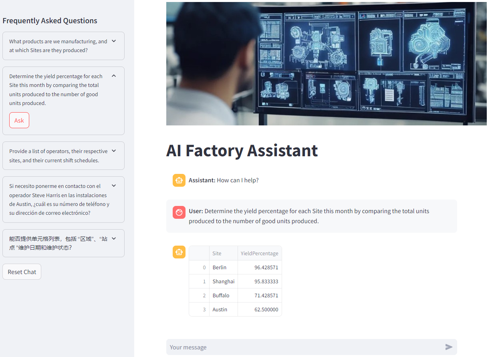

# 🗣️ Talk to your factory - implementation guide

## Introduction
🤖 Smart Factory demo, enhanced by Generative AI.  
🏭 See how the Smart Factory leverages Generative AI to optimize its operations!  
🔍 Real-time ingestion and processing of operations data (OT): operators, manufactured products, and machine maintenance schedules.  
🗣️ Data processing: Edge and Cloud, with a Semantic Kernel to power the Factory Assistant, for smarter interactions.  

[Video on the IoT Show](https://youtu.be/-AxWwJU_G_U?feature=shared), Demo starts at [19:54](https://youtu.be/-AxWwJU_G_U?feature=shared&t=1194)

### Key features and benefits

- **Data Processing**: Data structure following a **Medallion Architecture**, with the goal of incrementally and progressively improving the structure and quality of data as it flows through each layer of the architecture.  
From `Bronze` (Edge/Simulator) ⇒ `Silver` (Edge/Azure IoT Operations Data Processor) ⇒ `Gold` (Cloud/Fabric) layer tables.

- **Natural Language Processing (NLP)**: a Smart Assistant, enhanced by Generative AI, empowers operators, so they can ask complex questions about machine operations, staff, production quality, as if they were speaking to a human expert in the Factory.

## Architecture

### Solution architecture overview

### Factory simulation

### Key components

1. **Factory Simulator**  
    Simulates data coming from several factories: Berlin, Austin, Buffalo, Shanghai.  
    Factory simulator is publishing data to an Message Queuing Telemetry Transport (MQTT) broker topic based on the international standard from the International Society of Automation known as 'ISA-95' with the following format: Enterprise/Site/Area/Line/Cell.  
    Industrial machines involved in the process are 'Cells.'  

2. **Azure IoT Operations**  
    Processes data at Edge: normalize, contextualize, enrich with Edge reference datasets (Operator Data, Production Data) and aggregate every minute.

3. **Azure Event Hub**  
    Data ingestion in Azure.     
    
4. **Microsoft Fabric**  
    Processes data in Azure: materialize data as a Table, enrich with Cloud reference datasets (Maintenance Data, Directory Data).

5. **Generative AI Factory Assistant**  
    Introducing a custom Large Language Model (LLM) Factory Assistant, based on OpenAI model 'GPT-4o', that enables natural language communication with the factory. This assistant simplifies the process of retrieving information from various systems and databases.

### Communication flow

- **User Prompt**: user asks a question to the Factory Assistant.
- **Custom Large Language Model (LLM) Factory Assistant**: analyze prompt and write the statement to query the Database in Fabric.
- **Semantic Kernel**: execute query in background and return results (Python code).
- **Web Application**: provide the graphical user interface (based on the open-source framework 'Streamlit').

## Prerequisites

### Hardware requirements

1. **Resources**: 
    - CPU: `4 vCPU`
    - Memory: `16GB`
    - Storage: `30GB`

2. **Operating System**: the solution requires a Linux-based system, specifically a VM or physical machine running Linux Ubuntu 22.04. This system will perform as an Edge server, handling queries directly from the production line and interfacing with other operational systems.

### Software requirements

 - [Azure CLI](https://learn.microsoft.com/en-us/cli/azure/) the Azure command-line interface.
 - [K3s](https://k3s.io/) Lightweight Kubernetes. Easy to install, half the memory, all in a binary of less than 100 MB.
 - [curl](https://curl.se/) command line tool that developers use to transfer data to and from a server.
 - [nano](https://www.nano-editor.org/): text editor.

### Cloud services requirements

 - Azure Subscription (with Contributor rights)
    - Resource Group
    - Key Vault
    - Event Hub
    - Azure Open AI Service
    - _Optional_: Virtual Machine (if you want to test everything in Azure Cloud)
 - Microsoft Fabric Tenant (you can try it for free [here](https://www.microsoft.com/en-us/microsoft-fabric/getting-started?msockid=27cd43526f4e6b2a1fa857d06e486a3c))

## Solution build steps

1. [Provision resources (Edge and Cloud)](./INSTALL-1.md)
2. [Connect your Edge platform to Cloud platform](./INSTALL-2.md)
3. [Configure the solution (Cloud part)](./INSTALL-3.md)

## Demo

