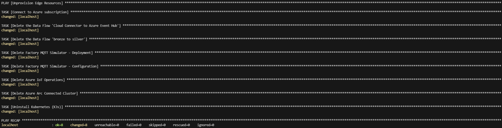

# Uninstall procedure

## Edge part
  - From the Edge Cluster, execute the following command:
    ```bash
    curl -O https://raw.githubusercontent.com/chriscrcodes/talk-to-your-factory/main/artifacts/templates/deploy/5_edge-unprovision.yaml
    ansible-playbook 5_edge-unprovision.yaml
    ```
    
## Cloud part
  - From Azure Portal > Azure Cloud Shell, upload the files `variables.yaml` (from your Edge Cluster) and [`6_cloud-unprovision.yaml`](./artifacts/templates/deploy/6_cloud-unprovision.yaml) via `Manage files` > `Upload`.
  - Execute the following command:
    ```bash
    ansible-playbook 6_cloud-unprovision.yaml
    ```
    