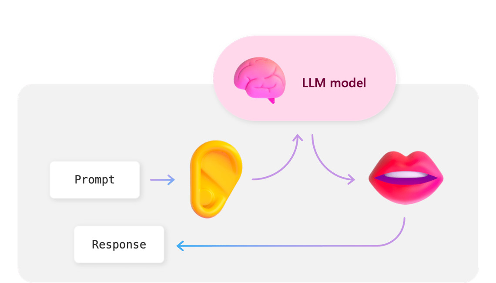

# 🗣️ Talk to your Factory - Implementation Guide

## Introduction
🤖 Discover my demo on the Smart Factory, enhanced by Generative AI.  
🏭 See how the Smart Factory leverages Generative AI to optimize its operations!  
🔍 We collect real-time data on operators, manufactured products, and machine maintenance schedules.  
🗣️ Data is processed at Edge then in the Cloud, while the Semantic Kernel powers our conversational agent for smarter interactions.  

[Video on the IoT Show](https://youtu.be/-AxWwJU_G_U?feature=shared), Demo starts at [19:54](https://youtu.be/-AxWwJU_G_U?feature=shared&t=1194)

### Key Features and Benefits

- **Data Processing**: Data is organized following a medallion architecture, with the goal of incrementally and progressively improving the structure and quality of data as it flows through each layer of the architecture.  
From Bronze (Edge/Simulator) ⇒ Silver (Edge/Azure IoT Operations Data Processor) ⇒ Gold (Cloud/Fabric) layer tables.

- **Natural Language Processing**: a Smart Assistant, enhanced by Generative AI, allow operators to ask complex questions about machine operations, staff, production quality, as if they were speaking to a human expert in the Factory.

## Architecture

### Architecture Overview

### Key Components

1. **Factory Simulator**  
    Simulates data coming from several factories: Berlin, Austin, Buffalo, Shanghai.  
    Data is sent to a MQTT topic with ISA95 structure: Enterprise/Site/Area/Line/Cell.  
    (Industrial machines involved in the process are referred to as “Cells”).  

2. **Azure IoT Operations**  
    Processes data at Edge: normalize, contextualize, enrich with Edge reference datasets (Operator Data, Production Data) and aggregate every minute.
    
3. **Microsoft Fabric**
    Processes data in the Cloud: materialize data as a Table, enrich with Cloud reference dataset.

4. **GenAI Factory Agent**
    Introducing a custom LLM (Language Learning Model) agent that enables natural language communication with the factory. This agent simplifies the process of retrieving information from various systems and databases.

### Communication Flow

- **User Prompt**: user asks a question to the Factory Agent.
- **LLM**: analyze prompt and write the query to be executed in Fabric KQL Database.
- **Semantic Kernel**: execute query in backend and return results.
- **Streamlit**: provide the graphical user interface.

## Solution Overview

## Pre-requisites

### Hardware Requirements

### Software Requirements

### Network Requirements

#### Azure Arc for Kubernetes

#### Control Plane

#### Data Plane

## Solution Build Steps

### Step 1 - Building an Ubuntu VM running Azure IoT Operations

### Step 2 - Deploy the solution

## Test the solution

## Conclusion